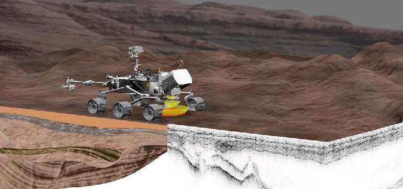

# RIMFAX : radar à pénétration de sol pour l'étude du sous-sol martien

## Contexte scientifique

## Objectifs

## Importation des données

## Analyse spectrale

### FFT

### Fenêtrage

### Zero-padding

## Filtrage

## Interprétation planétologique

### Compensation de la profondeur

### Modélisation hyperbolique

### Estimation de la permittivité

### Exportation du résultat