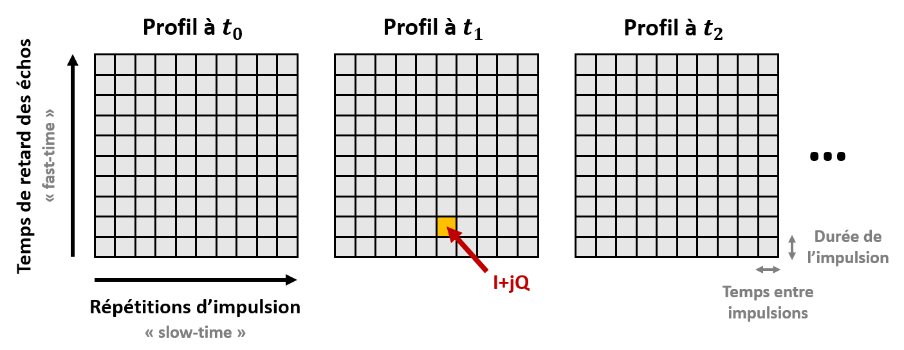
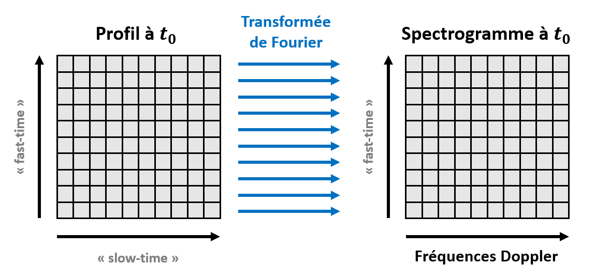
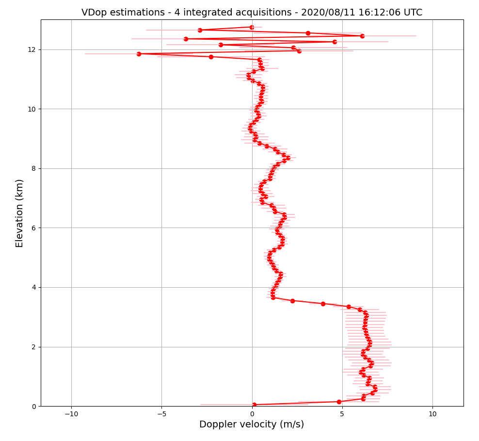
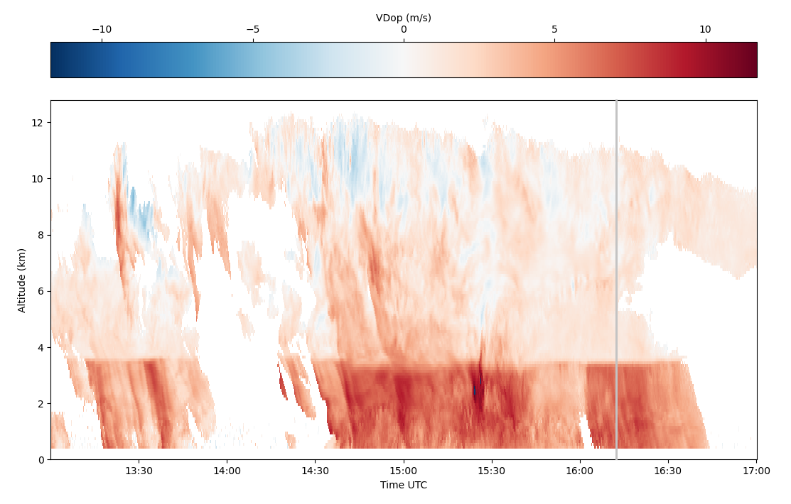
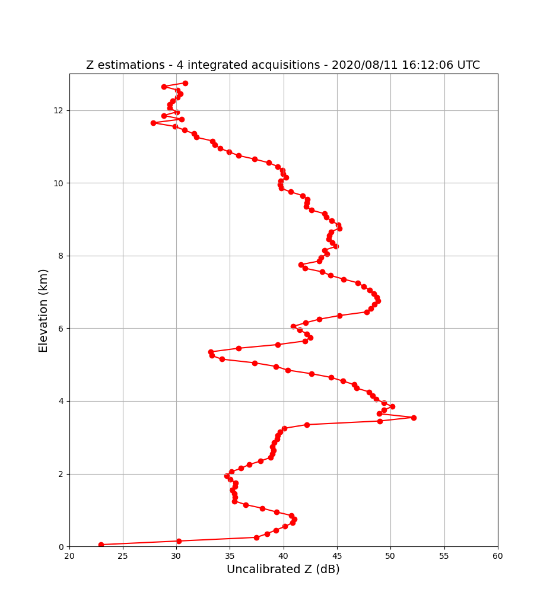
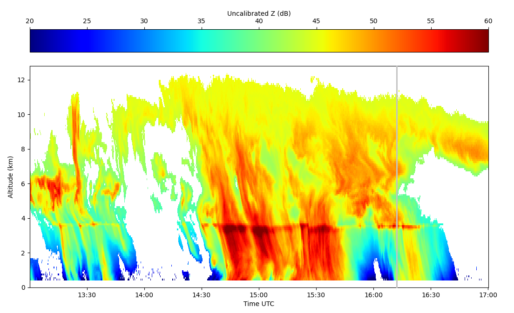

# ROXI : radar météorologique pour l'étude de la pluie

_"Rob McKenna had 231 different types of rain entered in his little book, and he didn't like any of them."_

**Douglas Adams, So Long and Thanks for All the Fish (1984)**

---

## Contexte scientifique

**ROXI** est un **radar météorologique** en développement au LATMOS depuis 2016.
Fonctionnant en bande X (à une fréquence de 9,42 GHz), il est conçu pour l'**étude des précipitations**.

ROXI est à **visée zénithale** : son antenne est orientée vers le zénith, dans le but d'acquérir des "**profils verticaux**" des propriétés des précipitations en fonction de l'élévation.
Ces profils sont acquis à intervalles de temps réguliers, afin de suivre l'évolution temporelle d'un évènement de précipitations.

Il s'agit d'un radar **impulsionnel** : il émet une impulsion électromagnétique vers le zénith, et réceptionne les échos provenant des gouttes de pluie ou des cristaux de glace rencontrés par l'impulsion.

* Le temps de retard entre l'émission de l'impulsion et la réception des échos permettra de déterminer leur **distance au radar** (correspondant ici à l'élévation).

* La durée de l'impulsion définira alors la **résolution verticale** de l'instrument.

* La puissance des échos reçus comparée à la puissance de l'impulsion émise permettra d'estimer la **réflectivité** des hydrométéores, une information utile pour déterminer la **phase** (liquide ou solide) et l'**intensité** (taux de pluie) des précipitations.

Il s'agit également d'un radar **Doppler** : en réalité il réalise des milliers d'émissions d'impulsion en quelques secondes, afin d'estimer la vitesse des cibles par **effet Doppler**.
En effet, la différence entre les signaux acquis pour une même élévation mais pour des émissions d'impulsion différentes, est liée au mouvement des hydrométéores, et permet donc de discriminer leurs différentes **vitesses de chute**. 
Cette information est liée au diamètre et à la phase des hydrométéores, permettant ainsi la caractérisation de la **microphysique** des précipitations.

* Le taux de répétition entre 2 émissions d'impulsion définira la **portée maximale** de l'instrument (l'élévation maximale mesurable).

* Le temps entre 2 émissions d'impulsions, le nombre d'impulsions d'affilée, ainsi que la longueur d'onde du radar définiront la résolution en vitesses et la **vitesse ambigue** (vitesse maximale mesurable) du radar.
Nous détaillerons comment dans la suite.

Les données d'un profil de radar impulsionnel Doppler comme ROXI ressemblent donc à une matrice 2D :

* Chaque élément de la matrice est un **nombre complexe** I+Q (In-phase / Quadrature-phase) contenant les informations d'**amplitude** et de **phase** des échos reçus pour un temps de retard et une émission d'impulsion donnée.

* L'axe vertical correspond aux temps de retard des échos pour une émission d'impulsion donnée, aussi appelé "**fast-time**".

* L'axe horizotal correspond aux temps entre 2 répétitions d'impulsion, aussi appelé "**slow-time**".

Pour chaque niveau d'élévation, nous pouvons obtenir par analyse spectrale une présentation de la puissance reçue par le radar en fonction de la vitesse Doppler mesurée, appelée **spectre Doppler**.

Ces spectres peuvent ensuite être concaténés verticalement afin d'obtenir une représentation sous la forme d'une image appelée **spectrogramme Doppler**.

On peut voir chaque spectre Doppler comme la distribution des puissances reçues par le radar par rapport à la vitesse des hydrométéores au sein d'un volume sondé.
Il est courant d'essayer de modéliser cette distribution par un modèle Gaussien, afin d'en tirer 2 caractéristiques des précipitations : leur réfléctivité moyenne **Z**, et leur vitesse moyenne **VDop**.

De ces caractéristiques pourrons être inférées des **grandeurs météorologiques** d'intérêt : le régime de précipitation, sa phase, son intensité, etc.

Voici les caractéristiques du radar ROXI :

|Caractéristique                  |Valeur   |
|:-------------------------------:|:-------:|
|Fréquence d'émission             |9.42 GHz |
|Puissance d'émission             |70 W     |
|Gain de l'antenne                |41 dBi   |
|Durée de l'impulsion             |666.67 ns|
|Période de répétition d'impulsion|682.67 µs|
|Nombre d'impulsions par profil   |4096     |
|Distance ambiguë                 |12.8 km  |
|Vitesse ambiguë                  |11.66 m/s|

## Objectifs

Lors de ce tutoriel, nous allons programmer une **chaîne de traitement des données de ROXI** sous la forme d'un **projet Python**, que nous utiliserons pour obtenir une **interprétation météorologique** classique.

Ce projet Python devra contenir des fonctions pour :

* Importer des données ROXI à partir d'un fichier HDF5 tel que celui qui vous sera fourni.

* Convertir en spectres Doppler les données I+Q acquises par le radar.

* Réaliser une intégration incohérente des spectres obtenus pour réduire le bruit.

* Appliquer un filtre "anti-clutter" aux spectres intégrés.

* Ajuster un modèle Gaussien aux spectres Doppler pour en déduire Z et VDop.

* Exporter les estimations de Z et VDop obtenues sous la forme d'un fichier HDF5.

Créez le dossier de votre projet, et structurez-le avec des sous-dossiers et des fichiers vides pour l'instant.

**Pour faire simple, n'ajouterons pas de tests ou de documentation à notre projet Python.**

|Nota Bene|
|:-|
|Il est à noter que notre exemple ici a été grandement simplifié pour les besoins de ce TP.|
|En particulier, l'estimation de Z, qui nécessite normalement une réelle calibration du radar pour compenser tous les effets instrumentaux.|

## Importation des données

### Le format HDF5

Lors de ce TP, nous partirons du principe que les données ROXI sont mises sous la forme de fichiers **HDF5**.

Le "Hierarchical Data Format" est un format de fichiers utilisé pour stocker de grandes quantités d'informations de manière organisée et accessible efficacement.
C'est pourquoi il est très classique en analyse de données.

Comme son nom l'indique, les données sont stockées hiérarchiquement, à la manière de l'arborescence d'un dossier sur votre ordinateur.
L'équivalent d'un dossier dans un fichier HDF5 est ce que l'on appelle un "**Group**".
On peut alors ranger les données dans des Groups, voir même dans des sous-Groups d'un Group.

Les données stockées sont enregistrées sous la forme de tableaux, que l'on appelle des "**datasets**".

On peut également stocker des métadonnées, sous la forme "d'**attributs**".

Nous verrons comment lire un fichier HDF5 avec Python, puis comment exporter des données dans ce format, grâce à la bibliothèque `h5py`.

### Exemple de données ROXI

Vous trouverez un fichier de données ROXI au format HDF5 [ici](https://github.com/NicOudart/UVSQ_M2_NewSpace_TP_signal/blob/master/example/ROXI_20200811_161206.h5).

### Lecture du fichier

~~~
import h5py
import numpy as np
~~~

~~~
hf = h5py.File(".../ROXI_20200811_161206.h5",'r')
~~~

~~~
mat_iq = np.array(hf.get('I+Q'))
frequency_axis = np.array(hf.get('frequency_axis'))
x_position_axis = np.array(hf.get('x_position_axis'))
y_position_axis = np.array(hf.get('y_position_axis'))
~~~

## Analyse spectrale

### Nature des données

~~~
import matplotlib.pyplot as plt
~~~

~~~
plt.figure()
plt.plot(slow_time_axis,np.real(mat_iq[0][10]),'r-')
plt.plot(slow_time_axis,np.imag(mat_iq[0][10]),'g-')
plt.xlabel('Slow-time (s)')
plt.ylabel('Unicalibrated voltage (V)')
plt.title('I+Q - acquisition 0 - fast-time level 10')
plt.grid()
plt.show()
~~~

### FFT avec Numpy

~~~
import numpy as np
~~~

~~~
slow_time_dt = slow_time_axis[1]-slow_time_axis[0]
frequency_axis = np.fft.fftfreq(len(slow_time_axis),d=slow_time_dt)
~~~

~~~
spectrum_0_10 = np.abs(np.fft.fft(mat_iq[0][10]))**2
~~~

### FFTshift et dB

~~~
spectrum_0_10 = np.fft.fftshift(spectrum_0_10)
frequency_axis = np.fft.fftshift(frequency_axis)
~~~

~~~
spectrum_0_10_db = 10*np.log10(spectrum_0_10)
~~~

~~~
plt.figure()
plt.plot(frequency_axis,spectrum_0_10_db,'r-')
plt.xlabel('Doppler frequency (Hz)')
plt.ylabel('Uncalibrated power (dB)')
plt.title('Doppler spectrum - acquisition 0 - fast-time level 10')
plt.grid()
plt.show()
~~~

## Réduction du bruit

### Bruit et SNR

### Intégration incohérente

## Filtrage

### Ground clutter

### Filtre médian

~~~
from scipy.signal import medfilt
~~~

~~~
spectrum_0_2_db = medfilt(spectrum_0_2_db,kernel_size=7)
~~~

## Spectrogramme

~~~
len_fast_time = len(fast_time_axis)
len_slow_time = len(slow_time_axis)
mat_spectrum = np.zeros((len_fast_time,len_slow_time))
~~~

~~~
plt.figure()
plt.pcolormesh(frequency_axis,fast_time_axis,mat_spectrum)
plt.xlabel('Doppler frequency (Hz)')
plt.ylabel('Fast-time (s)')
plt.colorbar(label='Uncalibrated power (dB)')
plt.title('Doppler spectrogram - 4 integrated acquisitions - 2020/08/11 16:12:06 UTC')
plt.show()
~~~

## Interprétation météorologique

### Conversion en vitesses et élévations

### Modélisation Gaussienne

~~~
from scipy.optimize import curve_fit
~~~

~~~
def gaussian_model(x,ampli,vdop,std):
	
    signal = ampli*np.exp(-(x-vdop)**2/(2*std**2))/(std*np.sqrt(2*np.pi))
	
    return 10*np.log10(signal+10**(-57/10))
~~~

~~~
params,_ = curve_fit(gaussian_model,vdop_axis,mat_spectrum_db[10],p0=[1e3,0,1],bounds=([0,-12,0],[1e6,12,3]))
ampli,vdop,std = params
~~~

~~~
plt.figure()
plt.plot(vdop_axis,mat_spectrum_db[10],'r-')
plt.plot(vdop_axis,gaussian_model(vdop_axis,ampli,vdop,std),'b--')
plt.xlabel('Doppler velocity (m/s)')
plt.ylabel('Uncalibrated power (dB)')
plt.title('Doppler spectrum modelling - 4 integrated acquisitions - fast-time level 10')
plt.legend(['observation','model'])
plt.grid()
plt.show()
~~~

### Estimation de Z et VDop

### Exportation du résultat

