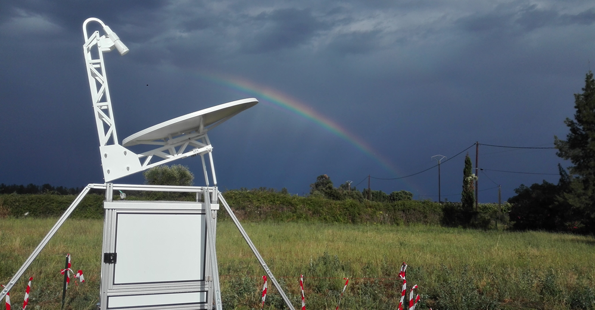
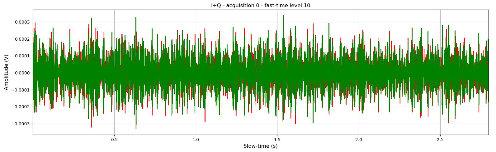
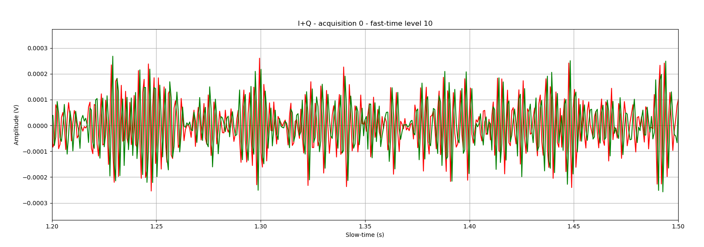
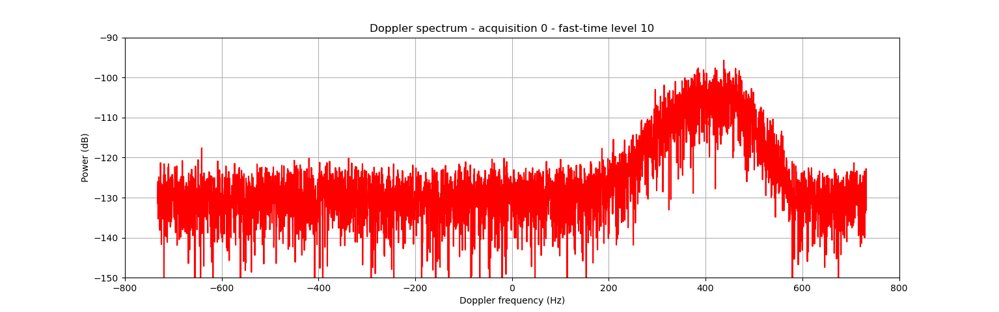
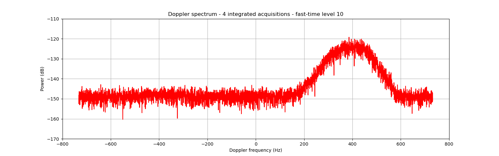
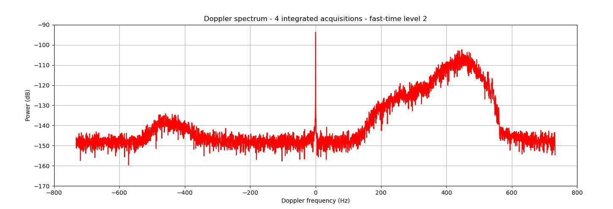
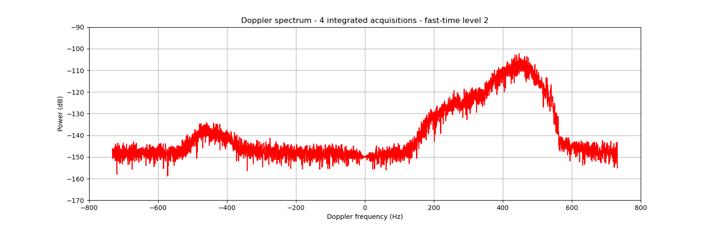
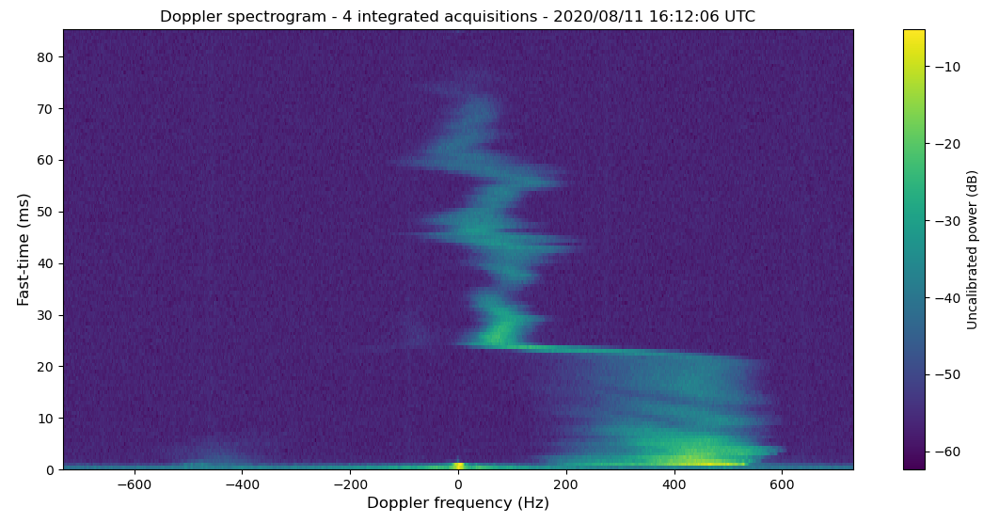
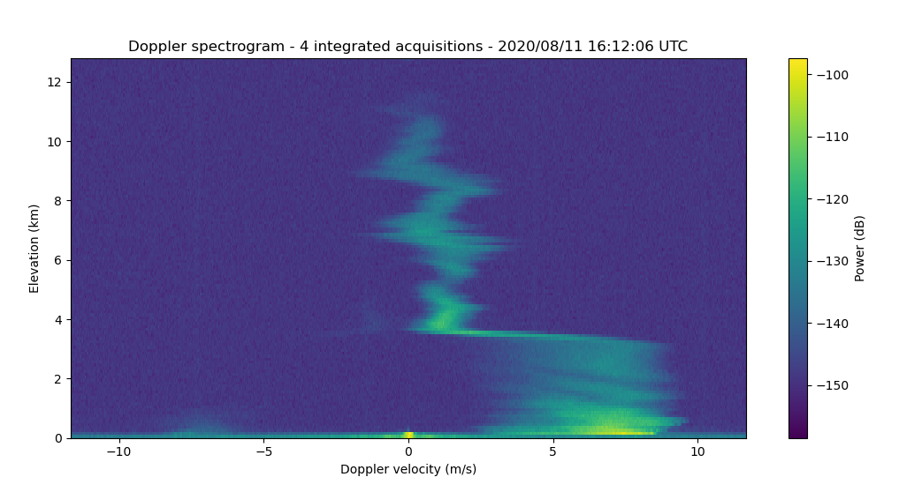
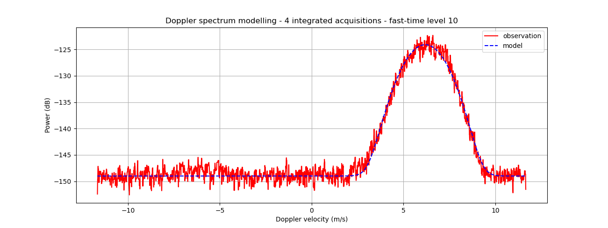

# ROXI : radar météorologique pour l'étude de la pluie

## Contexte scientifique

**ROXI** est un **radar météorologique** en développement au LATMOS depuis 2016.
Fonctionnant en bande X (à une fréquence de 9,42 GHz), il est conçu pour l'**étude des précipitations**.

ROXI est à **visée zénithale** : son antenne est orientée vers le zénith, dans le but d'acquérir des **profils verticaux** des propriétés des précipitations en fonction de l'élévation.
Ces profils sont acquis à intervalles de temps réguliers, afin de suivre l'évolution temporelle d'un évènement de précipitations.

Il s'agit d'un radar **impulsionnel** : il émet une impulsion électromagnétique vers le zénith, et réceptionne les échos provenant des gouttes de pluie ou des cristaux de glace rencontrés par l'impulsion.

* Le temps de retard entre l'émission de l'impulsion et la réception des échos permettra de déterminer leur **distance au radar** (correspondant ici à l'élévation).

* La durée de l'impulsion définira alors la **résolution verticale** de l'instrument.

* La puissance des échos reçus comparée à la puissance de l'impulsion émise permettra d'estimer la **réflectivité** des hydrométéores, une information utile pour déterminer la **phase** (liquide ou solide) et l'**intensité** (taux de pluie) des précipitations.

Il s'agit également d'un radar **Doppler** : en réalité il réalise des milliers de sondages verticaux en quelques secondes, afin d'estimer la vitesse des cibles par **effet Doppler**.
En effet, la différence entre les signaux acquis pour une même élévation à des instants différents est liée au mouvement des hydrométéores, et permet donc de discriminer leurs différentes **vitesses de chute**. 
Cette information est liée au diamètre et à la phase des hydrométéores, permettant ainsi la caractérisation de la **microphysique** des précipitations.

* Le taux de répétition entre 2 émissions d'impulsion définira la **portée maximale** de l'instrument (l'élévation maximale mesurable).

* Le temps entre 2 émissions d'impulsions, le nombre d'impulsions d'affilée, ainsi que la longueur d'onde du radar définiront la résolution en vitesses et la **vitesse ambigue** (vitesse maximale mesurable) du radar.
Nous détaillerons comment dans la suite.

Les données d'un radar impulsionnel Doppler comme ROXI ressemblent donc à une matrice 2D :

* Chaque élément de la matrice est un **nombre complexe** I+Q (In-phase / Quadrature-phase) contenant les informations d'**amplitude** et de **phase** des échos reçus pour un temps de retard et un sondage vertical donné.

* L'axe vertical correspond aux temps de retard des échos pour un sondage, aussi appelé "**fast-time**".

* L'axe horizotal correspond aux temps entre les sondages (répétitions d'impulsion), aussi appelé "**slow-time**".

Pour chaque niveau d'élévation, nous pouvons obtenir une présentation de la puissance reçue par le radar en fonction de la vitesse Doppler mesurée, appelée **spectre Doppler**.

Ces spectres peuvent ensuite être concaténés verticalement afin d'obtenir une représentation sous la forme d'une image appelée **spectrogramme Doppler**.

On peut voir chaque spectre Doppler comme la distribution des puissances reçues par le radar par rapport à la vitesse des hydrométéores au sein d'un volume sondé.
Il est courant d'essayer de modéliser cette distribution par un modèle Gaussien, afin d'en tirer 2 caractéristiques des précipitations : leur réfléctivité moyenne **Z**, et leur vitesse moyenne **VDop**.

De ces caractéristiques pourrons être inférées des **grandeurs météorologiques** d'intérêt : le régime de précipitation, sa phase, son intensité, etc.

## Objectifs

Lors de ce tutoriel, nous allons programmer une **chaîne de traitement des données de ROXI** sous la forme d'un **projet Python**, que nous utiliserons pour obtenir une **interprétation météorologique** classique.

Ce projet Python devra contenir des fonctions pour :

* Importer des données ROXI à partir d'un fichier HDF5 tel que celui qui vous sera fourni.

* Appliquer un filtre "anti-clutter" aux données brutes I+Q.

* Convertir en spectres Doppler les données I+Q acquises par le radar.

* Réaliser une intégration incohérente des spectres obtenus pour réduire le bruit.

* Ajuster un modèle Gaussien aux spectres Doppler pour en déduire Z et VDop.

**Pour faire simple, n'ajouterons pas de tests ou de documentation à notre projet Python.**

## Importation des données

### Le format HDF5

### Exemple de données ROXI

### Lecture du fichier

~~~
import h5py
import numpy as np
~~~

~~~
hf = h5py.File(".../ROXI_20200811_161206.h5",'r')
~~~

~~~
mat_iq = np.array(hf.get('I+Q'))
frequency_axis = np.array(hf.get('frequency_axis'))
x_position_axis = np.array(hf.get('x_position_axis'))
y_position_axis = np.array(hf.get('y_position_axis'))
~~~

## Analyse spectrale

### Nature des données

~~~
import matplotlib.pyplot as plt
~~~

~~~
plt.figure()
plt.plot(slow_time_axis,np.real(mat_iq[0][10]),'r-')
plt.plot(slow_time_axis,np.imag(mat_iq[0][10]),'g-')
plt.xlabel('Slow-time (s)')
plt.ylabel('Amplitude (V)')
plt.title('I+Q - acquisition 0 - fast-time level 10')
plt.grid()
plt.show()
~~~

### FFT avec Numpy

~~~
import numpy as np
~~~

~~~
slow_time_dt = slow_time_axis[1]-slow_time_axis[0]
frequency_axis = np.fft.fftfreq(len(slow_time_axis),d=slow_time_dt)
~~~

~~~
spectrum_0_10 = np.abs(np.fft.fft(mat_iq[0][10]))/len(slow_time_axis)
~~~

~~~
spectrum_0_10_watts = ((spectrum_0_10/np.sqrt(2))**2)/50
~~~

### FFTshift et dB

~~~
spectrum_0_10_watts = np.fft.fftshift(spectrum_0_10_watts)
frequency_axis = np.fft.fftshift(frequency_axis)
~~~

~~~
spectrum_0_10_db = 10*np.log10(spectrum_0_10_watts)
~~~

~~~
plt.figure()
plt.plot(frequency_axis,spectrum_0_10_db,'r-')
plt.xlabel('Doppler frequency (Hz)')
plt.ylabel('Power (dB)')
plt.title('Doppler spectrum - acquisition 0 - fast-time level 10')
plt.grid()
plt.show()
~~~

## Réduction du bruit

### Bruit et SNR

### Intégration incohérente

## Filtrage

### Ground clutter

### Filtre médian

~~~
from scipy.signal import medfilt
~~~

~~~
spectrum_0_2_watts = medfilt(spectrum_0_2_watts,kernel_size=7)
~~~

## Spectrogramme

~~~
plt.figure()
plt.pcolormesh(frequency_axis,fast_time_axis,mat_spectrum)
plt.xlabel('Doppler frequency (Hz)')
plt.ylabel('Fast-time (s)')
plt.colorbar(label='Power (dB)')
plt.title('Doppler spectrogram - 4 integrated acquisitions - 2020/08/11 16:12:06 UTC')
plt.show()
~~~

## Interprétation météorologique

### Conversion en vitesses et élévations

### Modélisation Gaussienne

~~~
from scipy.optimize import curve_fit
~~~

~~~
def gaussian_model(x,ampli,vdop,std):

    return 10*np.log10(ampli*np.exp(-(x-vdop)**2/(2*std**2))/(std*np.sqrt(2*np.pi))+1)-149
~~~

~~~
params,_ = curve_fit(gaussian_model,vdop_axis,mat_spectrum_db[10],p0=[1e3,0,1],bounds=([1,-12,0],[1e6,12,2]))
ampli,vdop,std = params
~~~

~~~
plt.figure()
plt.plot(vdop_axis,mat_spectrum_db[10],'r-')
plt.plot(vdop_axis,gaussian_model(vdop_axis,ampli,vdop,std),'b--')
plt.xlabel('Doppler velocity (m/s)')
plt.ylabel('Power (dB)')
plt.title('Doppler spectrum modelling - 4 integrated acquisitions - fast-time level 10')
plt.legend(['observation','model'])
plt.grid()
plt.show()
~~~

### Compensation de la distance

### Constante radar et étalonnage

### Estimation de Z et VDop

### Exportation du résultat