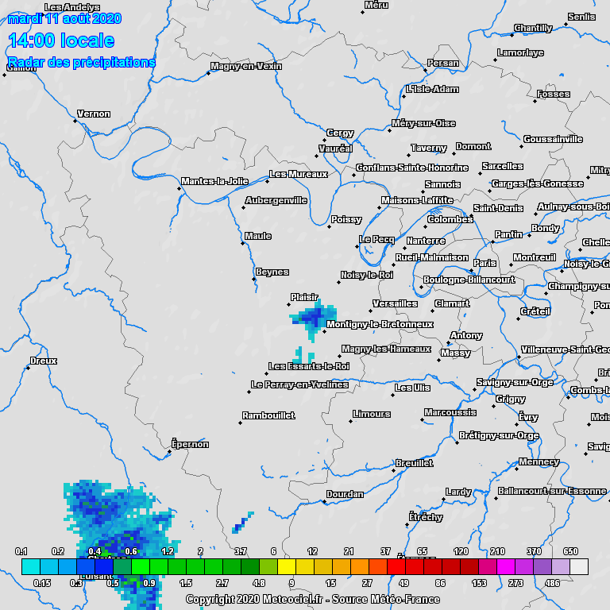

# ROXI : radar météorologique pour l'étude de la pluie

_"Rob McKenna had 231 different types of rain entered in his little book, and he didn't like any of them. [...] Since he had left Denmark the previous afternoon, he had been through types 33 (light pricking drizzle which made the roads slippery), 39 (heavy spotting), 47 to 51 (vertical light drizzle through to sharply slanting light to moderate drizzle freshening), 87 and 88 (two finely distinguished varieties of vertical torrential downpour), 100 (post-downpour squalling, cold), all the seastorm types between 192 and 213 at once, 123, 124, 126, 127 (mild and intermediate cold gusting, regular and syncopated cab-drumming), 11 (breezy droplets), and now his least favourite of all, 17."_

**Douglas Adams, So Long and Thanks for All the Fish (1984)**

---

## Contexte scientifique

**ROXI** est un **radar météorologique** en développement au LATMOS depuis 2016.
Fonctionnant en bande X (à une fréquence de 9,42 GHz), il est conçu pour l'**étude des précipitations**.

ROXI est à **visée zénithale** : son antenne est orientée vers le zénith, dans le but d'acquérir des "**profils verticaux**" des propriétés des précipitations en fonction de l'élévation.
Ces profils sont acquis à intervalles de temps réguliers, afin de suivre l'évolution temporelle d'un évènement de précipitations.

Il s'agit d'un radar **impulsionnel** : il émet une impulsion électromagnétique vers le zénith, et réceptionne les échos provenant des gouttes de pluie ou des cristaux de glace rencontrés par l'impulsion.

* Le temps de retard entre l'émission de l'impulsion et la réception des échos permettra de déterminer leur **distance au radar** (correspondant ici à l'élévation).

* La durée de l'impulsion définira alors la **résolution verticale** de l'instrument.

* La puissance des échos reçus comparée à la puissance de l'impulsion émise permettra d'estimer la **réflectivité** des hydrométéores, une information utile pour déterminer la **phase** (liquide ou solide) et l'**intensité** (taux de pluie) des précipitations.

Il s'agit également d'un radar **Doppler** : en réalité il réalise des milliers d'émissions d'impulsion en quelques secondes, afin d'estimer la vitesse des cibles par **effet Doppler**.
En effet, la différence entre les signaux acquis pour une même élévation mais pour des émissions d'impulsion différentes, est liée au mouvement des hydrométéores, et permet donc de discriminer leurs différentes **vitesses de chute**. 
Cette information est liée au diamètre et à la phase des hydrométéores, permettant ainsi la caractérisation de la **microphysique** des précipitations.

* Le taux de répétition entre 2 émissions d'impulsion définira la **portée maximale** de l'instrument (l'élévation maximale mesurable).

* Le temps entre 2 émissions d'impulsions, le nombre d'impulsions d'affilée, ainsi que la longueur d'onde du radar définiront la résolution en vitesses et la **vitesse ambigue** (vitesse maximale mesurable) du radar.
Nous détaillerons comment dans la suite.

Les données d'un profil de radar impulsionnel Doppler comme ROXI ressemblent donc à une matrice 2D :

* Chaque élément de la matrice est un **nombre complexe** I/Q (In-phase / Quadrature-phase) contenant les informations d'**amplitude** et de **phase** des échos reçus pour un temps de retard et une émission d'impulsion donnée.

* L'axe vertical correspond aux temps de retard des échos pour une émission d'impulsion donnée, aussi appelé "**fast-time**".

* L'axe horizotal correspond aux temps entre 2 répétitions d'impulsion, aussi appelé "**slow-time**".

Pour chaque niveau d'élévation, nous pouvons obtenir par analyse spectrale une présentation de la puissance reçue par le radar en fonction de la vitesse Doppler mesurée, appelée **spectre Doppler**.

Ces spectres peuvent ensuite être concaténés verticalement afin d'obtenir une représentation sous la forme d'une image appelée **spectrogramme Doppler**.

On peut voir chaque spectre Doppler comme la distribution des puissances reçues par le radar par rapport à la vitesse des hydrométéores au sein d'un volume sondé.
Il est courant d'essayer de modéliser cette distribution par un modèle Gaussien, afin d'en tirer 2 caractéristiques des précipitations : leur réfléctivité totale **Z**, et leur vitesse moyenne **VDop**.

De ces caractéristiques pourrons être inférées des **grandeurs météorologiques** d'intérêt : le régime de précipitation, sa phase, son intensité, etc.

Voici les caractéristiques du radar ROXI :

|Caractéristique                  |Valeur   |
|:-------------------------------:|:-------:|
|Fréquence d'émission             |9.42 GHz |
|Puissance d'émission             |70 W     |
|Gain de l'antenne                |41 dBi   |
|Durée de l'impulsion             |666.67 ns|
|Période de répétition d'impulsion|682.67 µs|
|Nombre d'impulsions par profil   |4096     |
|Distance ambiguë                 |12.8 km  |
|Vitesse ambiguë                  |11.66 m/s|

## Objectifs

Lors de ce tutoriel, nous allons programmer une **chaîne de traitement des données de ROXI** sous la forme d'un **projet Python**, que nous utiliserons pour obtenir une **interprétation météorologique** classique.

Ce projet Python devra contenir des fonctions pour :

* Importer des données ROXI à partir d'un fichier HDF5 tel que celui qui vous sera fourni.

* Convertir en spectres Doppler les données I+Q acquises par le radar.

* Réaliser une intégration incohérente des spectres obtenus pour réduire le bruit.

* Appliquer un filtre "anti-clutter" aux spectres intégrés.

* Ajuster un modèle Gaussien aux spectres Doppler pour en déduire Z et VDop.

* Exporter les estimations de Z et VDop obtenues sous la forme d'un fichier HDF5.

Créez le dossier de votre projet, et structurez-le avec des sous-dossiers et des fichiers vides pour l'instant.

**Pour faire simple, n'ajouterons pas de tests ou de documentation à notre projet Python.**

|Nota Bene|
|:-|
|Il est à noter que notre exemple ici a été grandement simplifié pour les besoins de ce TP.|
|En particulier, l'estimation de Z, qui nécessite normalement une réelle calibration du radar pour compenser tous les effets instrumentaux.|

## Importation des données

### Le format HDF5

Lors de ce TP, nous partirons du principe que les données ROXI sont mises sous la forme de fichiers **HDF5**.

Le "Hierarchical Data Format" est un format de fichiers utilisé pour **stocker de grandes quantités d'informations** de manière organisée et accessible efficacement.
C'est pourquoi il est très classique en analyse de données.

Comme son nom l'indique, les données sont stockées hiérarchiquement, à la manière de l'arborescence d'un dossier sur votre ordinateur.
L'équivalent d'un dossier dans un fichier HDF5 est ce que l'on appelle un "**Group**".
On peut alors ranger les données dans des Groups, voir même dans des sous-Groups d'un Group.

Les données stockées sont enregistrées sous la forme de tableaux, que l'on appelle des "**Datasets**".

On peut également stocker des métadonnées, sous la forme "d'**Attributes**".

Nous verrons comment lire un fichier HDF5 avec Python, puis comment exporter des données dans ce format, grâce à la bibliothèque `h5py`.

### Exemple de données ROXI

Vous trouverez un exemple de fichier de **données ROXI** au format **HDF5** [ici](https://github.com/NicOudart/UVSQ_M2_NewSpace_TP_signal/blob/master/example/ROXI_20200811_161206.h5).

On considérera qu'un fichier de données ROXI contient toujours les 3 "Datasets" suivants, directement à la racine :

* `I+Q` : une matrice de dimensions 4x128x4096, correspondant à **4 profils** acquis d'affilée, contenant chacun **128 échantillons fast-time** pour **4096 échantillons slow-time**.
Chaque élément de la matrice est donc un nombre complexe I/Q mesuré par le radar (homogène à des volts).
Ces 4 profils étant acquis sur un lapse de temps très court, on peut considérer qu'il s'agit de 4 répétitions d'un même profil.

* `fast_time_axis` : un vecteur de dimension 128, contenant les temps de retard des échos (s), correspondants aux **128 échantillons fast-time**.

* `slow_time_axis` : un vecteur de dimension 4096, contenant les temps d'émission des impulsions (s), correspondants aux **4096 échantillons slow-time**.

Ces données ont été acquises le **11/08/2020** à **16:12:06 UTC** sur le site de l'**Observatoire de Versailles Saint-Quentin** (OVSQ), à Guyancourt.

Il s'agit d'une observation d'un **orage multicellulaire** survenu à la fin de la canicule d'août 2020.
Une vague chaleur atteignant les 38°C, ainsi qu'une forte humidité dans les basses couches atmosphériques ont favorisé la formation de cet évènement convectif, qui a duré de 12:30 à 18:00 UTC, avec des hydrométéores détectés jusqu'à 12 km d'élévation.
Si son intensité est restée relativement modérée au-dessus de Guyancourt, de violentes averses ont été enregistrées localement en région parisienne, notamment en Essonne.

Voici une animation Météo-France de l'évènement, avec les taux de précipitations estimés en mm/h :

Ce fichier nous servira d'exemple pour construire notre **chaîne de traitement des données ROXI**.

|Nota Bene|
|:-|
|En réalité, les données ROXI n'étant pas très lourdes, elles sont enregistrées dans des fichiers binaires qui ne sont pas au format HDF5.|
|Un fichier ROXI contient également des métadonnées qui ne vous sont pas fournies ici.|
|Pour les besoins de ce TP, nous avons donc fait en sorte de vous faire découvrir un format utile, et simplifié le contenu des données ROXI.|

### Lecture du fichier

La 1ère étape de notre de chaîne traitement sera d'importer les données ROXI d'un fichier HDF5.

|Ajoutez à votre projet Python une fonction `read`|
|:-|
|Cette section vous donnera les éléments nécessaires pour la compléter.|
|- Elle prendra en entrée le chemin d'un fichier HDF5.|
|- Elle retournera 3 matrices `numpy`, correspondants aux 3 "Datasets" contenus dans le fichier.|

Pour lire et écrire un fichier HDF5, nous utiliserons la bibliothèque Python `h5py`.

Nous convertirons les "Datasets" contenus dans un fichier en matrices `numpy`.

N'oubliez donc pas d'importer ces 2 bibliothèques avec les commandes suivantes :

~~~
import h5py
import numpy as np
~~~

Pour importer un fichier HDF5 avec `h5py`, on crée un objet `File`.

Voici ce que cela donnerait sur notre exemple :

~~~
hf = h5py.File(".../ROXI_20200811_161206.h5",'r')
~~~

On peut alors récupérer les différents "Datasets" contenus dans le fichier avec la méthode `get` et leurs noms.
On oubliera pas de convertir en matrices `numpy` les "Datasets" récupérés.

Voici ce que pourrait donner la récupération des 3 "Datasets" d'un fichier ROXI :

~~~
mat_iq = np.array(hf.get('I+Q'))
fast_time_axis = np.array(hf.get('fast_time_axis'))
slow_time_axis = np.array(hf.get('slow_time_axis'))
~~~

**Vous pouvez à présent compléter votre fonction `read`**.

Appliquez votre fonction à notre fichier exemple.

_Les dimensions des matrices récupérées sont-elles bien celles attendues ? Le type des données également ?_

## Analyse spectrale

La 2nde étape de notre de chaîne traitement sera de générer un spectre à partir des données ROXI récupérées.

|Ajoutez à votre projet Python une fonction `FFT`|
|:-|
|Cette section vous donnera les éléments nécessaires pour la compléter.|
|- Elle prendra en entrée 3 matrices `numpy` telles que retournées par la fonction `read`.|
|- Elle retournera 2 matrices `numpy` : une contenant les 4 spectrogrammes Doppler correspondant aux 4 profils, et l'autre l'axe des fréquences correspondant à ces spectrogrammes.|

### Nature des données

Dans un 1er temps, nous allons nous intéresser à la nature des données dont nous disposons.

Importez la bibliothèque `matplotlib`, qui va nous servir à faire des affichages graphiques :

~~~
import matplotlib.pyplot as plt
~~~

Essayons tout d'abord d'afficher une série temporelle "slow-time" issue de nos données.

Prenons le 1er profil, et regardons la série temporelle "slow-time" pour le niveau du 11ème échantillon "fast-time".
Affichons les parties réelle et imaginaire du signal avec des commandes Python de ce type :

~~~
plt.figure()
plt.plot(slow_time_axis,np.real(mat_iq[0][10]),'r-')
plt.plot(slow_time_axis,np.imag(mat_iq[0][10]),'g-')
plt.xlabel('Slow-time (s)')
plt.ylabel('Unicalibrated voltage (V)')
plt.title('I+Q - acquisition 0 - fast-time level 10')
plt.grid()
plt.show()
~~~

On obtient alors la courbe suivante :

Si on fait un zoom sur une partie de la courbe, on voit qu'il s'agit d'un **signal périodique** :

Ces oscillations correspondent aux décalages de fréquence par effet Doppler, liés aux mouvements verticaux des hydrométéores dans le volume sondé (au niveau du 11ème échantillon "fast-time").
Tous les hydrométéores n'ayant pas la même vitesse verticale, et la même réfléctivé radar, ce signal est une **somme de sinusoïdes complexes**, dont la fréquence est d'autant plus grande que la vitesse est élevée.

D'où l'intérêt de vouloir réaliser une **analyse spectrale** de ce signal, afin de séparer les différents décalages de fréquence Doppler, et la puissance associée à chacun.

Avant de réaliser cette analyse, posez-vous les questions suivantes :

* _Quelle fréquence Doppler maximale peut mesurer ROXI ?_

* _Quelle est la résolution en fréquence de ROXI ?_

* _Retrouvez-vous bien la durée de d'une impulsion et la période de répétition d'impulsion de ROXI ?_

Répondez-y en vous appuyant sur les axes "fast-time" et "slow-time" que vous avez récupérés.

### FFT avec Numpy

Pour réaliser l'analyse spectrale des séries temporelles "slow-time" de ROXI, nous allons utiliser la "**Fast Fourier Transform**".
Il s'agit d'un algorithme calculant la transformée de Fourier discrète de manière significativement plus rapide que la méthode naïve.

La bibliothèque `numpy` contient une implémentation de la FFT.

N'oubliez donc pas d'importer cette bibliothèque :

~~~
import numpy as np
~~~

Pour déterminer l'axe des fréquences qui ira avec nos spectres Doppler, on peut utiliser la méthode `fft.fftfreq` de `numpy`.
Cette méthode prend en entrée la longueur de l'axe temporel du signal à analyser, et le pas temporel correspondant.

On pourra donc utiliser des commandes Python de ce genre :

~~~
slow_time_dt = slow_time_axis[1]-slow_time_axis[0]
frequency_axis = np.fft.fftfreq(len(slow_time_axis),d=slow_time_dt)
~~~

La sortie d'une transformée de Fourier est une série de **nombres complexes**, contenant les informations d'**amplitude** et de **phase** du spectre.

L'information de phase n'est généralement pas exploitée, car elle ne contient pas d'information physique intéressante.
L'amplitude en revanche permet d'estimer la puissance reçue pour chaque décalage de fréquence Doppler.

L'amplitude du spectre en sortie de la FFT sera homogène à une tension.
Pour obtenir une grandeur homogène à une **puissance**, nous prendrons son module, et nous le mettrons au carré.

On utilisera la méthode `fft.fft` de `numpy`, avec une commande similaire à celle-ci :

~~~
spectrum_0_10 = np.abs(np.fft.fft(mat_iq[0][10]))**2
~~~

|Nota Bene|
|:-|
|Les puissances obtenues ici ne sont pas calibrées.|
|En effet, les tensions ne sont pas calibrées, et nous n'avons pas divisé par une impédance.|
|Il y a donc un offset avec la vraie puissance reçue pour chaque fréquence en dB.|

Essayez sur le 11ème échantillon "fast-time" du 1er profil.

_Observez-vous des composantes fréquentielles ressortir ?_
_Dans quelle ordre méthode `fft.fft` sort-elle les fréquences du spectre ?_

### FFTshift et dB

Vous l'avez compris, l'implémentation `numpy` de la FFT sort les fréquences dans un ordre un peu contre-intuitif.
La raison de cet ordre est purement algorithmique.

Pour **ordonner** les sorties de la fréquence négative la plus faible à la fréquence positive la plus élevée, avec le 0 au milieu, on pourra utiliser la méthode `fft.fftshift` de `numpy`.

Voici un exemple de commandes pour l'axe fréquentiel et le spectre renvoyé par la FFT :

~~~
spectrum_0_10 = np.fft.fftshift(spectrum_0_10)
frequency_axis = np.fft.fftshift(frequency_axis)
~~~

_D'un point de vue physique, que signifie avoir un décalage de fréquence Doppler positif ou négatif ?_
_Que se passera-t-il si les mouvements des cibles provoquent des décalages Doppler de fréquences supérieures à la limite de ROXI ?_

Les puissances reçues par un radar météorologique peuvent varier sur 6 ou 7 ordres de grandeur.
C'est pourquoi on converti en général les spectres Doppler en **décibels**.

Ceci peut facilement être fait avec une commande Python de ce genre : 

~~~
spectrum_0_10_db = 10*np.log10(spectrum_0_10)
~~~

Pour voir à quoi ressemble un spectre Doppler ROXI après ces 2 traitements, vous pouvez utiliser des commandes Python similaires à celles-ci :

~~~
plt.figure()
plt.plot(frequency_axis,spectrum_0_10_db,'r-')
plt.xlabel('Doppler frequency (Hz)')
plt.ylabel('Uncalibrated power (dB)')
plt.title('Doppler spectrum - acquisition 0 - fast-time level 10')
plt.grid()
plt.show()
~~~

Voici à quoi ressemble le spectre pour le 11ème échantillon "fast-time" du 1er profil :

On observe une distribution quasi-gaussienne, avec un pic aux alentours de 400 Hz de décalage Doppler.
Cette forme est assez classique pour un signal météorologique.
Un **modèle gaussien** sera d'ailleurs souvent utilisé lors de l'interprétation des spectres Doppler d'un radar météorologique.

**Vous pouvez à présent compléter votre fonction `FFT`**.

Appliquez votre fonction à notre exemple.
Regardez différents spectres pour différents profils et différents échantillons "fast-time".

_Le spectre est-il toujours gaussien ?_
_La fréquence du pic est-elle toujours la même ?_
_Voyez-vous des pics ayant l'air d'avoir une autre origine que les précipitations ?_

## Réduction du bruit

Vous l'avez sûrement remarqué, les spectres Doppler ROXI sont bruités.

Extraire le signal utile du bruit est un des grands enjeux du traitement du signal.
Dans le cas de ROXI, nous pouvons tirer profit du fait que nous disposons de 4 répétitions du même profil, pour diminuer le bruit en les intégrant.

L'étape suivante de notre chaîne de traitement sera donc logiquement d'implémenter une "**intégration incohérente**" (définirons ce terme dans la suite) pour réduire le bruit dans les spectres Doppler.

|Ajoutez à votre projet Python une fonction `integrate`|
|:-|
|Cette section vous donnera les éléments nécessaires pour la compléter.|
|- Elle prendra en entrée une matrice `numpy` contenant 4 spectrogrammes tels que retournée par `FFT`.|
|- Elle retournera une matrice `numpy` contenant le spectrogramme intégré à partir des 4 profils.|

### Intégration cohérente

Un **bruit blanc** dans une série temporelle donnera un spectre plat.
Le spectre d'un signal bruité contiendra donc un offset, dont le niveau correspondra au **niveau du bruit**.

Si on trace un spectre en décibels, la différence entre le pic du signal utile et le niveau du bruit donnera le ratio signal/bruit ou **SNR**.

On comprend intuitivement que plus le pic dépasse du niveau de bruit (donc plus le SNR est élevé), meilleure sera la détection puis la caractérisation du signal utile.

Mettons que l'on dispose de plusieurs répétitions d'une même série temporelle, et que l'on fait l'hypothèse que la **phase du signal** reste **cohérente** entre 2 répétitions, et que le **bruit** est **aléatoire**.
**Moyenner** les différentes répétitions permettra d'obtenir une série temporelle de **SNR plus élevé**, et donc un spectre au **niveau de bruit plus bas**.

Cette méthode reposant sur l'hypothèse de cohérence de la phase du signal entre 2 répétitions, on l'appelle "**intégration cohérente**".

Nous ne l'implémenterons pas ici, mais elle est faite par ROXI de manière cachée : en réalité, un profil ROXI est issu de **8 intégrations cohérentes**.
Ce qui explique pourquoi la période de répétition d'impulsion de ROXI n'est pas égale à 128 fois la durée de son impulsion, mais 128x8.

|Nota Bene|
|:-|
|Par linéairité de la transformée de Fourier, il est équivalent d'appliquer l'intégration à la série temporelle ou à son spectre.|
|On pourrait donc tout aussi bien l'appliquer avant FFT.|

Bien entendu, l'intégration cohérente à des limites : **plus on intègre longtemps**, plus les cibles auront bougé, et donc **moins l'hypothèse de cohérence de la phase sera vérifiée**.

_Quel est environ le niveau du bruit pour les différents spectres obtenus ? Est-il le même pour tous les spectres ? Comment expliquez-vous ceci ?_

_Quel est environ le SNR pour le spectre obtenu plus tôt avec le 11ème échantillon "fast-time" du 1er profil ?_

Petite question bonus :

Plus on augmente le nombre d'intégration cohérentes, plus l'intervalle entre 2 échantillons "slow-time" est grand.
_Quelle performance du radar est donc impactée lorsque l'on augmente le nombre d'intégrations cohérentes ?_

### Intégration incohérente

Nous implémenterons ici l'**intégration incohérente** (ou "non-cohérente").

Par opposition avec l'intégration cohérente, l'intégration incohérente **moyenne les puissances des spectres** obtenus après FFT et module au carré pour les différentes répétitions d'une même série temporelle, **en excluant l'information de phase**.

Le résultat est que le niveau de bruit du spectre ne varie pas, mais le spectre obtenu est **plus "lisse"**.

|Nota Bene|
|:-|
|L'opération "module" n'étant pas linéaire, contrairement à l'intégration cohérente, l'intégration incohérente doit être effectuée après FFT.|

Tout comme l'intégration cohérente, l'intégration incohérente a des limites : la forme des spectres évolue au fur et à mesure que les cibles se déplacent ou changent, et au bout d'un certain temps intégrer les spectres n'a plus aucun sens.
En météorologie radar, on ne dépasse généralement pas quelques secondes.

**Vous pouvez à présent compléter votre fonction `integrate`** : elle fera la moyenne des 4 spectrogrammes en puissances obtenus à partir des 4 profils contenus dans un fichier de données ROXI.

Si vous appliquez votre fonction à notre exemple, et que vous affichez le spectre obtenu pour le 11ème échantillon "fast-time", vous devriez obtenir ceci :

_Observez-vous bien le résultat attendu ? D'après-vous, quel sera l'intérêt de lisser ainsi les spectres Doppler de ROXI ?_

## Filtrage

La prochaine étape de notre chaîne de traitement sera d'appliquer un **filtre médian** à nos spectres Doppler.

Ce filtrage dans le domaine fréquentiel aura 2 objectifs :

* **Lisser encore plus les spectres**, afin de faciliter leur interprétation.

* Réduire l'effet des **échos de sol** aussi appelés "ground clutter" en anglais.

|Ajoutez à votre projet Python une fonction `filter`|
|:-|
|Cette section vous donnera les éléments nécessaires pour la compléter.|
|- Elle prendra en entrée une matrice `numpy` contenant un spectrogramme intégré tel que retournée par `integrate`.|
|- Elle retournera une matrice `numpy` contenant le spectrogramme filtré.|

### Ground clutter

Avant d'implémenter le filtrage médian, voyons un peu les effets du "**ground clutter**".

Si vous affichez le spectre intégré obtenu pour le 3ème échantillon "fast-time", vous obtiendrez :

On voit nettement un pic très fin autour de **0 Hz**.
Il correspond aux échos de cibles situées **au sol**.

En effet, bien que le lobe principal de l'antenne de ROXI soit très étroit, il peut recevoir des échos provenant du sol (bâtiments, arbres, etc.).
Ces cibles n'étant pas en mouvement par rapport au radar, elle produisent des échos de **décalage Doppler nul**.

Comme les cibles au sol sont proches du radar, on voit particulièrement ces échos parasites dans les premiers échantillons "fast-time".

Regardez le spectre correspondant au dernier échantillon "fast-time".
Vous devriez observer un pic correspondant à du "ground clutter".

_Comment expliquez-vous ceci ?_

### Filtre médian

Le **filtre médian** est couramment utilisé pour le "despiking", ou filtrage de **bruit impulsionnel**.

Lorsqu'un signal contient des **pics abérrants**, le filtrage médian permet de réduire ces parasites sans trop déformer le signal.

Il s'agit simplement d'une **fenêtre glissante**, qui vient remplacer la valeur centrale de la fenêtre par **la médiane** des valeurs dans la fenêtre.

On pourra s'appuyer sur l'implémentation de la bibliothèque Python `scipy.signal`, la méthode `medfilt`.
N'oubliez donc pas de l'importer :

~~~
from scipy.signal import medfilt
~~~

On peut spécifier à la méthode **les dimensions de la fenêtre** avec l'argument `kernel_size`.

Il s'agit forcément d'un **nombre impair**.
Pour le "despiking", on choisit en général 3, 5 ou 7 maximum.

Voici un exemple de commande appliquant `medfilt` pour un fenêtre de dimension 7 :

~~~
spectrum_0_2_db = medfilt(spectrum_0_2_db,kernel_size=7)
~~~

Si vous appliquez cette méthode au spectre correspondant au 3ème échantillon "fast-time", vous obtiendrez ceci :

On voit que le pic correspondant au "ground clutter" a été réduit de 40 dB !
Le spectre est plus lisse, sans avoir été trop déformé.

Vous pouvez essayer d'autres valeurs de `kernel_size` :

_Que se passe-t-il si vous diminuez ou augmentez cette valeur ?_

**Vous pouvez à présent compléter votre fonction `filter`**.

Appliquez-là à notre exemple, et confirmez la réduction du "ground clutter" pour les différents spectres.

|Nota Bene|
|:-|
|En météorologie radar, il existe d'autres techniques classiques pour réduire le "ground clutter" :|
|- Soustraire une mesure d'air clair à chaque série temporelle I/Q avant FFT.|
|- Appliquer à chaque série temporelle I/Q un filtre coupe-bande très étroit, type "notch", avant FFT.|
|- Soustraire 2 à 2 les échantillons des séries temporelles I/Q avant FFT.|

## Spectrogramme

Notre chaîne de traitement des données ROXI est à présent assez avancée pour pouvoir afficher un **spectrogramme Doppler** interprétable.

Mettons que nous ayons récupéré en sortie de notre chaîne actuelle une matrice `numpy` 2D du nom de `mat_spectrum`, contenant notre spectrogramme (en dB).
Nous pouvons facilement l'afficher avec les commandes `matplotlib` suivantes :

~~~
plt.figure()
plt.pcolormesh(frequency_axis,fast_time_axis,mat_spectrum)
plt.xlabel('Doppler frequency (Hz)')
plt.ylabel('Fast-time (s)')
plt.colorbar(label='Uncalibrated power (dB)')
plt.title('Doppler spectrogram - 4 integrated acquisitions - 2020/08/11 16:12:06 UTC')
plt.show()
~~~

Voici le spectrogramme que vous devriez obtenir pour notre exemple :

On observe clairement 2 grands types d'échos : 

* En-dessous de 25 ms de "fast-time", les décalages en fréquence Doppler sont plus élevés, avec des distributions plus larges.

* Au-dessus de 25 ms de "fast-time", les décalages en fréquence Doppler sont plus faibles, avec des distributions plus étroites.

Pour pouvoir interpréter ces 2 populations d'hydrométéores, il va nous falloir convertir les axes de "fast-time" et de fréquences Doppler en **élévations** et **vitesses verticales**.

Ensuite, nous devrons extraire des variables météorologiques utiles de chaque spectre : **réflectivité Z** et **vitesse verticale moyenne VDop**.

## Interprétation météorologique

L'étape suivante de notre chaîne de traitement sera donc une fonction pour l'interprétation météorologique des spectres Doppler ROXI.

|Ajoutez à votre projet Python une fonction `interpret`|
|:-|
|Cette section vous donnera les éléments nécessaires pour la compléter.|
|- Elle prendra en entrée 3 matrices `numpy` : un spectrogramme intégré et filtré, un axe de "fast-time", un axe de fréquences Doppler.|
|- Elle retournera 3 matrices `numpy` : un profil d'estimations de Z, un profil d'estimations de VDop, et un axe d'élévations correspondant.|

Cette fonction suivra les grandes étapes suivantes :

* Convertir les axes de "fast-time" et de fréquences Doppler en **élévation** et **vitesses verticales**.

* Ajuster un modèle gaussien à chaque spectre Doppler, pour récupérer de estimations de **puissance reçue** et **VDop**.

* Convertir la puissance reçue en **réflectivité Z** (non calibrée) avec une correction de l'élévation.

### Conversion en élévations et vitesses verticales

Pour commencer, il nous faut pouvoir convertir l'axe de "fast-time" en **élévations**.

Les ondes éléctromagnétiques se propageant à environ **la vitesse de la lumière** dans l'atmosphère terrestre, cette conversion est très simple.
Il faut juste faire attention au fait que l'impulsion radar fait un **aller-retour** entre l'antenne et une cible.

Si on note $h$ l'élévation, $dt$ le temps de retard des échos, et $c$ la vitesse de la lumière, on a :

$h = \frac{c \times dt}{2}$

Ensuite, il nous faudra convertir l'axe des décalages en fréquence Doppler en **vitesses verticales**.

On note $f_e$ la fréquence émise par le radar, et $f_r$ la fréquence reçue, et $v_D$ la vitesse verticale d'une cible.

Comme $v_D << c$, et que l'onde fait un aller-retour entre le radar et la cible, on peut écrire la formule de **l'effet Doppler** de la manière suivante :

$f_r \approx f_e (1 + \frac{v_D}{c})^2$

Si on développe cette formule, sachant que $v_D << c$, on peut considérer $(\frac{v_D}{c})^2$ comme négligeable.
Par conséquent :

$f_r \approx f_e (1 + \frac{2 v_D}{c})$

Et si on note $f_D = f_r - f_e$ le décalage en fréquence Doppler, on obtient :

$f_D = 2 f_e \frac{v_D}{c}$

Or, on sait que $f_e = \frac{c}{\lambda}$ avec $\lambda$ la longueur d'onde de l'impulsion radar.
Donc :

$f_D = 2 \frac{v_D}{\lambda}$

D'où la formule que nous utiliserons pour convertir les décalages en fréquence Doppler en vitesses verticales :

$v_D = \frac{f_D \lambda}{2}$

_Avec ces formules, retrouvez-vous bien la résolution en distance et la portée maximale de ROXI à partir de `fast_time_axis` ?_
_Et retrouvez-vous la vitesse ambiguë de ROXI à partir de `frequency_axis` ?_

Si vous utilisez ces formules pour convertir `fast_time_axis` et `frequency_axis`, vous pouvez afficher notre exemple de spectrogramme de manière plus interprétable :

On voit que la transition entre les 2 populations d'hydrométéores se fait à environ 3.5 km d'élévation, avec des vitesses aux alentours de 6 m/s pour la population la plus basse, et aux alentours de 1 m/s pour la population la plus haute.

Si on considère que ces vitesses verticales sont en 1ère approximation les vitesses de chute des hydrométéores, on peut déduire de ces vitesses que :

* La population la plus basse correspond à des **gouttes d'eau liquide**.

* La population la plus haute correspond à des **cristaux de glace d'eau**.

La température diminuant avec l'altitude dans la troposphère, cette interprétation est cohérente avec l'axe d'élévations.

3.5 km correspond donc approximativement à l'élévation de **l'isotherme zéro**, où les cristaux de glace **fondent** pour devenir gouttes d'eau.

Pour confirmer cette interprétation, voyons comment modéliser les spectres Doppler afin d'en tirer nos variables météorologiques d'intérêt.

### Modélisation Gaussienne

On modélise souvent les spectres Doppler de radar météorologiques par une **fonction gaussienne** de la vitesse verticale $v$, de la forme suivante :

$g(v) = \frac{P}{\sigma \sqrt{2 \pi}} exp(\frac{-(v-v_{Dop})^2}{2 \sigma^2})$

avec $P$ la puissance totale du spectre, $v_{Dop}$ la vitesse Doppler moyenne, et $\sigma$ son écart-type.

Pour ajuster un tel modèle à nos spectres Doppler, nous pourrons utiliser la méthode `curve_fit` de la bibliothèque Python `scipy.optimize`, qui permet d'ajuster une fonction quelconque à une courbe.
Très pratique pour de l'interprétation de données !

N'oubliez donc pas d'importer cette méthode :

~~~
from scipy.optimize import curve_fit
~~~

Il faudra définir le modèle **gaussien** de spectre Doppler sous la forme d'une fonction Python.

Nos spectres étant noyé dans un bruit blanc de niveau constant d'environ -57 dB, et convertis en dB, notre modèle devra en tenir compte.

Voici une proposition de fonction, avec les entrées `v` pour $v$, `power` pour $P$, `vdop` pour $v_{Dop}$, et `std` pour $\sigma$ :

~~~
def gaussian_model(v,power,vdop,std):
	
    signal = power*np.exp(-(v-vdop)**2/(2*std**2))/(std*np.sqrt(2*np.pi))
	
    return 10*np.log10(signal+10**(-57/10))
~~~

Pour ajuster cette fonction à nos spectres en dB, il faudra la fournir en entrée de `curve_fit`, avec notre axe de fréquences Doppler `vdop_axis`.

Pour aider l'algorithme d'optimisation de `curve_fit` à converger, on pourra lui fournir une initialisation des paramètres à optimiser avec l'argument `p0`, ainsi que des bornes min et max avec l'argument `bounds`.

Le paramètre $v_{Dop}$ obtenu correspondra directement à **VDop**, et le paramètre $P$ correspondra à la puissance total du signal utile dans le spectre (bruit blanc non compris) que nous convertirons plus tard en **Z**.

Voici un exemple pour le 11ème spectre de notre spectrogramme (en dB) `mat_spectrum` :

~~~
params,_ = curve_fit(gaussian_model,vdop_axis,mat_spectrum[10],p0=[1e3,0,1],bounds=([0,-12,0],[1e6,12,3]))
power,vdop,std = params
~~~

Après ajustement, vous pouvez afficher notre modèle par dessus le spectre Doppler avec des commandes `matplotlib` de ce genre :

~~~
plt.figure()
plt.plot(vdop_axis,mat_spectrum[10],'r-')
plt.plot(vdop_axis,gaussian_model(vdop_axis,power,vdop,std),'b--')
plt.xlabel('Doppler velocity (m/s)')
plt.ylabel('Uncalibrated power (dB)')
plt.title('Doppler spectrum modelling - 4 integrated acquisitions - fast-time level 10')
plt.legend(['observation','model'])
plt.grid()
plt.show()
~~~

Voici le modèle que vous devriez alors obtenir :

Le modèle gaussien déterminé par `curve_fit` colle visiblement très bien à notre spectre Doppler.

On trouve que :

* $P \approx -28.4 dB$

* $V_{Dop} \approx 6.2 m/s$

* $\sigma \approx 0.9 m/s$

Il ne reste plus qu'à savoir comment convertir la puissance totale du spectre $P$ en réfléctivité Z.

|Nota Bene|
|:-|
|Si le modèle Gaussien simple est très courant car représentatif de la plupart des spectres Doppler météorologiques, il est parfois inadapté :|
|- Les vents de cisallement, ainsi que la turbulence, peuvent provoquer des spectres asymétriques.|
|- La présence de plusieurs populations d'hydrométéores au sein d'un même volume fera apparaitre plusieurs gaussiennes dans un même spectre.|
|- Des échos non-météorologiques (ground clutter, insectes, oiseaux, diffusion de Bragg, etc.) n'auront pas des spectres gaussiens.|

### Estimation de Z

La **puissance totale** du signal utile dans un spectre Doppler de radar météorologique, correspond à la **puissance reçue** de tous les hydrométéores contenus dans un volume sondé (à un niveau de "fast-time" donné).

Le problème de cette grandeur est qu'elle n'est **pas interprétable météorologiquement** telle quelle.

En effet, afin de les identifier et d'estimer leur distribution en tailles, nous aimerions plutôt connaitre la **réfléctivité** radar des hydrométéores : leur propention à réfléchir le signal du radar.

Contrairement à la puissance reçue, il s'agit d'une **propriété intrinsèque** des hydrométéores, ne dépendant ni des **effets instrumentaux**, ni de la **distance** des hydrométéores au radar.

Pour obtenir la **réfléctivité totale Z** des hydrométéores pour un spectre donné, les météorologues lui appliquent les compensations suivantes :

* Une compensation des **pertes en espace libre** : la puissance reçue d'un volume sondé diminue avec le carré de la distance parcourue par l'impulsion du radar (donc aller-retour).

* Une compensation des **effets instrumentaux** : la puissance émise, le gain des antennes, le faisceau d'émission, la durée de l'impulsion, les pertes interne, etc.

La formule pour convertir $P$ en Z est donc :

$Z = P \times C_{rad} \times R^2$

avec $C_{rad}$ la "**constante radar**", un coefficient prenant en compte tous les effets instrumentaux, et $R$ la **distance de propagation** de l'impulsion.

Cette grandeur est souvent exprimée en **décibels** (on parle de "dBZ"), et permet en théorie de comparer les résultats de 2 radars météorologiques différents. Pratique !

Dans le cadre de ce TP, nous n'implémenterons **que la compensation des pertes d'espace libre** : 

$Z_{dB} = P_{dB} + 20 log_{10}(R)$

Effet, la compensation des effets instrumentaux nécessite un tout travail d'**étalonnage** du radar, beaucoup trop délicat pour être réalisé ici.

Nous obtiendrons donc une valeur de Z en dB **non-calibrée**, qui sera décalé du vrai Z par un offset correspondant à $10 log_{10}(C_{rad})$.

**Vous pouvez enfin compléter votre fonction `interpret` !**

Nous allons l'appliquer à notre exemple, et analyser le résultat.

### Profils de Z et VDop

~~~
plt.figure()
plt.errorbar(x=vect_vdop,y=elevation_axis,xerr=vect_std,c='r',ecolor='pink')
plt.scatter(vect_vdop,elevation_axis,c='r',marker='o')
plt.xlabel('Doppler velocity (m/s)')
plt.ylabel('Elevation (m)')
plt.title('VDop estimations - 4 integrated acquisitions - 2020/08/11 16:12:06 UTC')
plt.grid()
plt.show()
~~~

~~~
plt.figure()
plt.plot(vect_Z,elevation_axis,'r-')
plt.scatter(vect_Z,elevation_axis,c='r',marker='o')
plt.xlabel('Uncalibrated Z (dB)')
plt.ylabel('Elevation (m)')
plt.title('Z estimations - 4 integrated acquisitions - 2020/08/11 16:12:06 UTC')
plt.grid()
plt.show()
~~~

### Exportation du résultat

### Conclusion