# WISDOM : radar à pénétration de sol pour l'étude du sous-sol martien

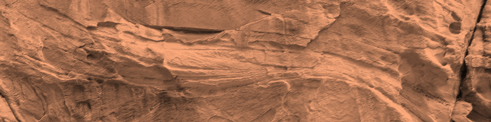

_"On a bien réfléchi et on s'est dit que le Graal, il devait sûrement être enterré. [...] Donc, par association d'idées, s'il est enterré, la meilleure chose à faire, c'est de creuser. [...] Après, on s'est posé la question de la profondeur. [...] On est partis sur trois pieds et demi."_

**Alexandre Astier, Kaamelott livre I, épisode 77 : Le Forage**

## Contexte scientifique

En 2030, le rover de la mission **ExoMars** (ESA), nommé "Rosalind Franklin", explorera le site d'Oxia Planum **à la recherche de potentielles traces d'une vie passée sur Mars**.

Dans l'hypothèse ou la vie serait apparue sur Mars lorsqu'elle était habitable, des milliards d'années d'exposition à des conditions hostiles (radiations et oxydation) en auront fait disparaitre toute trace à sa surface.
En revanche, on peut espérer qu'**à quelques mètres de profondeur dans le sous-sol**, qui n'a pas bougé faute d'activité tectonique, **de telles traces de vie auraient été préservées**.

C'est pourquoi le rover d'ExoMars sera le tout premier équipé d'une **foreuse** capable de récolter des échantillons **jusqu'à 2 m** dans le sous-sol martien.
Ces échantillons seront remontés dans le corps du rover, où une suite d'instruments pourra les analyser à la recherche de bio-marqueurs.

_Mais comment savoir où creuser ?_

Les forages seront longs et gourmands en énergie, on veut éviter d'abimer la foreuse sur de la roche trop dure, et le nombre de tubes à échantillons est limité.
Il est donc capital pour la mission d'**avoir un a priori sur le sous-sol avant de creuser**.

C'est là qu'interviendra le **radar à pénétration de sol WISDOM**, développé au LATMOS.

Il s'agit d'un instrument qui sera capable de révéler la **structure** des premiers mètres du sous-sol martien, et de donner des indices sur sa **composition**.
Avant toute opération de forage, WISDOM sondera le proche sous-sol pour déterminer si un site est **intéressant scientifiquement** et **sans danger pour la foreuse**.
Il donnera aussi un **contexte géophysique** aux échantillons récoltés.

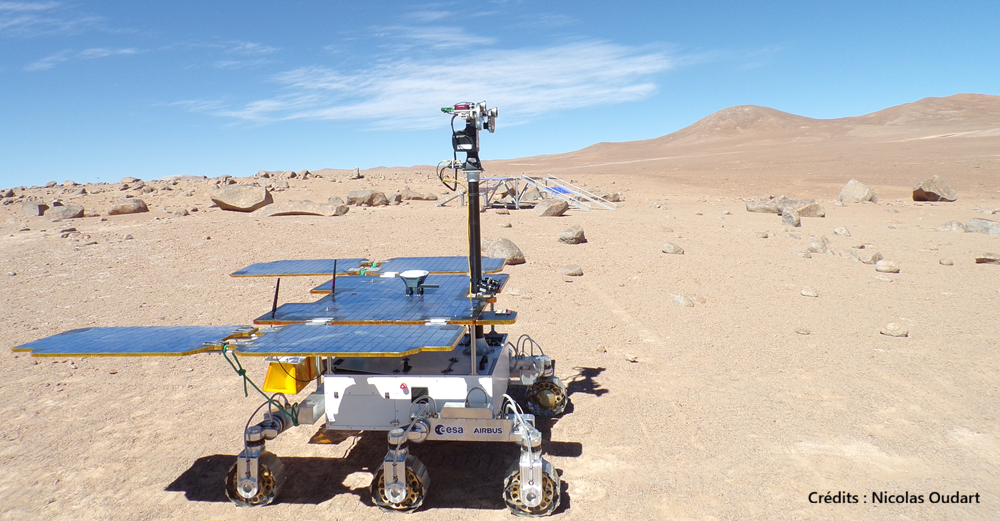

Les **antennes** de WISDOM seront situées **à l'arrière** du rover, et pointeront **vers le sol**, à environ 38 cm de la surface.

Pour sonder le sous-sol, un signal électromagnétiques sera envoyé par l'**antenne émettrice** en direction du sol.
A chaque **interface** entre matériaux de **propriétés électriques différentes** dans le sous-sol, une partie de ce signal sera renvoyé vers l'**antenne réceptrice**.

Ce signal sera plus ou moins intense suivant le **contraste de propriétés électriques**, et plus ou moins long à revenir suivant la **distance** entre les antennes et l'interface.

Chaque sondage permettra donc de récupérer un profil d'**amplitudes et de temps de retard des échos reçus**.
En réalisant des sondages à mesure que le rover se déplace, on obtiendra une série de profils pour différentes **distances horizontales** depuis le point de départ.

* A partir des **temps de retard** et de la **distance horizontale**, on obtiendra une 1ère idée de la **structure du sous-sol** (strates, hétérogénéité, inclusions, etc.), mais sans réelles estimations de profondeurs.

* A partir des amplitudes des échos, le contraste de **propriétés électriques** à l'interface entre 2 couches du sous-sol pourra être estimé, donnant une **indication de la composition** des différentes strates (roches volcaniques, roches sédimentaires, glace, etc.).

* La vitesse des ondes électromagnétiques dans un matériau dépendant en 1ère approximation de sa **permittivité diélectrique**, on pourra alors convertir les temps de retard des échos en **profondeurs** des interfaces.

Il est prévu que WISDOM réalise des sondages **à intervalles réguliers** de 10 cm le long de **lignes droites**, un opération que l'on appelle "**traverses**".
Ainsi, les sondages obtenus permettront de visualiser une "coupe" du sous-sol le long de cet axe.

Afin d'ajouter une 3ème dimension à l'étude d'un site donné, il est également prévu que WISDOM réalise jusqu'à **3 traverses en parallèle**, une opération que l'on appelle "**grid**".
Les 3 vues en "coupe" obtenues permettront alors d'obtenir une visualisation quasi-3D du sous-sol.

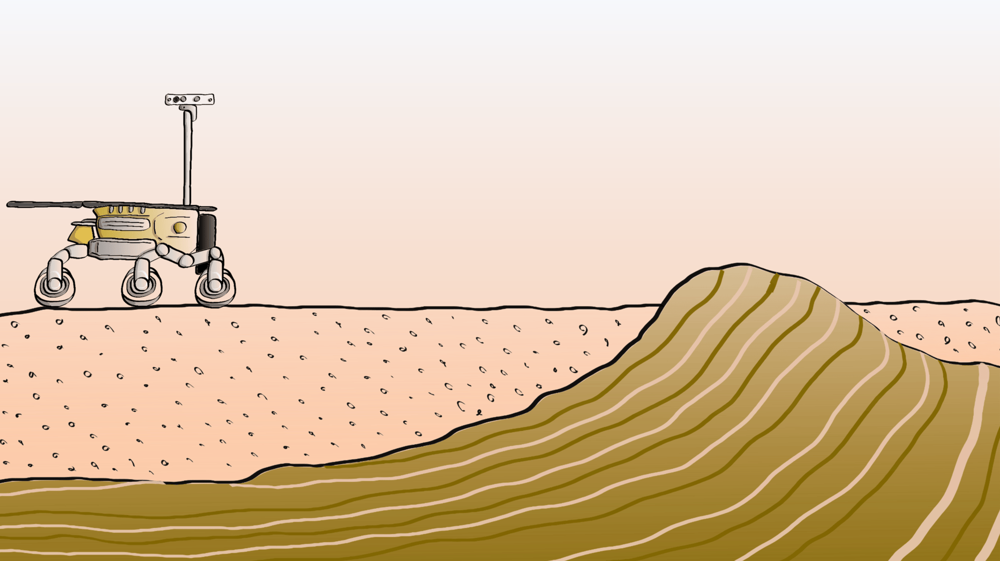

WISDOM est un radar **SFCW** ("Stepped Frequency Continuous Wave"), ce qui signifie qu'il n'émet pas une impulsion comme ROXI, mais des **signaux harmoniques continus de fréquences croissantes**, avec un pas régulier.

Pour chaque fréquence, le radar reçoit en retour un signal de même fréquence, résultant de l'interférence des différents échos aux différentes interfaces dans le sous-sol.
Son amplitude et sa phase seront enregistrés par l'instrument.

Ce type de radar fonctionne donc en **domaine fréquentiel** : avec ses mesures, il reconstruit l'**équivalent fréquentiel** de la **réponse impulsionnelle** du milieu sondé.
La **transformée de Fourier** des amplitudes et phases obtenues pour les différentes les fréquences permet de reconstituer la **série temporelle** qu'aurait obtenu un **radar impulsionnel équivalent** en sondant le même sous-sol.

C'est pourquoi on parle de "**spectres**" pour désigner les acquisitions de WISDOM pour un sondage donné.
La série temporelle obtenue après transformée de Fourier correspondra aux **échos** reçus pour différents **temps de retards**.

Cette méthode permet d'obtenir un radar nécessitant **moins de puissance**, avec des **signaux plus simples** à générer, ayant un **rapport signal / bruit** et une **dynamique meilleure** qu'un radar impulsionnel de résolution équivalente.
Bref, un instrument **plus compact** et **moins consommateur** en puissance : de gros avantages pour un instrument spatial !

|Nota Bene|
|:-|
|Un radar SFCW classique construit un complexe I/Q contenant les informations d'amplitude et de phase des signaux reçus pour chaque fréquence.|
|Mais ceci nécessite 2 chaînes d'acquisitions distinctes.|
|Par soucis de compacité de l'instrument, WISDOM ne mesure que la partie réelle I du signal.|
|Nous verrons dans la suite comment faire une analyse spectrale d'un signal réel.|

Les données WISDOM consistent donc en des spectres acquis à intervalles réguliers de distance, pour former une matrice 2D appellée "**spectrogramme**".

Après transformation de chaque spectre en série temporelle, on obtient une représentation des échos reçus en fonction du temps pour les différents sondages d'un traverse, appelé "**radargramme**".
Comme mentionné précédemment, l'axe des temps de retards pourra être converti en **profondeurs**, afin d'obtenir une vue en "coupe" du sous-sol.

3 radargrammes acquis en parallèle constitueront une **grid** WISDOM.

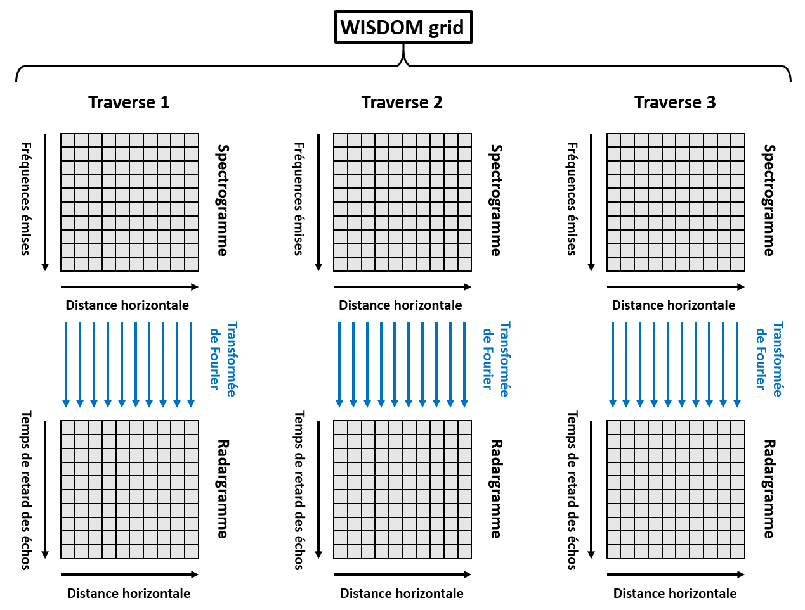

Lors de la mission ExoMars, il est prévu qu'une opération **grid** WISDOM soit réalisée à proximité d'un **affleurement** rocheux d'intérêt : une **roche sédimentaire argileuse** qui semble ressortir du régolith de surface.
Une telle roche, formée à l'époque où Mars était encore habitable, pourrait renfermer des **traces d'une hypothétique vie passée**.

Les 3 vues en coupes obtenues grâce à WISDOM pourront confirmer si cet affleurement rocheux **s'enfonce jusqu'à 2 m** dans le sous-sol, profondeur nécessaire à la **préservation de bio-marqueurs**.
Si tel est le cas, l'équipe WISDOM pourra indiquer **où creuser** pour récupérer **un échantillon** de cette roche.

Voici les caractéristiques du radar WISDOM :

|Caractéristique                                |Valeur       |
|:---------------------------------------------:|:-----------:|
|Fréquences d'émission                          |0.5 à 3 GHz  |
|Pas de fréquence d'émission                    |2.5 MHz      |
|Nombre de pas de fréquence                     |1001         |
|Durée d'un pas de fréquence                    |200 µs       |
|Puissance d'émission                           |1 mW typique |
|Gain des antennes                              |0 dBi minimum|
|Résolution en distance dans le vide            |6 cm         |
|Distance ambiguë dans le vide                  |30 m         |
|Résolution en distance typique dans le sous-sol|3 cm         |
|Portée typique dans le sous-sol                |3 m          |

Pour plus d'informations : [site de WISDOM](https://www.wisdom-radar.eu).

|Nota Bene|
|:-|
|Une particularité de WISDOM est qu'il s'agit d'un radar **polarimétrique**.|
|En réalité, il ne possède non pas 2 mais 4 antennes, lui permettant d'émettre et de recevoir dans **2 polarisations linéaires**.|
|Cette information supplémentaire permettra entre autre d'étudier la rugosité des interfaces dans le sous-sol.|
|Pour les besoins de ce TP, nous avons simplifié le contenu des données en ne laissant qu'une seule des 4 configurations polarimétriques possibles.|

## Objectifs

Lors de ce tutoriel, nous allons programmer une **chaîne de traitement des données de WISDOM** sous la forme d'un **projet Python**, que nous utiliserons pour obtenir une **interprétation géophysique** classique.

Ce projet Python devra contenir des fonctions pour :

* Importer des données WISDOM à partir d'un fichier HDF5 tel que celui qui vous sera fourni.

* Convertir en radargrammes les traverses de spectres acquis par le radar, en compensant les effets instrumentaux.

* Filtrer les échos parasites horizontaux.

* Appliquer un gain vertical pour compenser les pertes dans le sous-sol.

* Filtrer fréquentiellement les spectres afin de zoomer sur une zone précise d'un radargramme.

* Estimer la permittivité diélectrique du sous-sol à partir de la calibration du radar, et en déduire la conversion des temps de retard en profondeurs.

* Exporter les radargrammes obtenus sous la forme d'un fichier HDF5.

Créez le dossier de votre projet, et structurez-le avec des sous-dossiers et des fichiers vides pour l'instant.

**Pour faire simple, n'ajouterons pas de tests ou de documentation à notre projet Python.**

|Nota Bene|
|:-|
|Il est à noter que notre exemple ici a été grandement simplifié pour les besoins de ce TP.|
|Certains traitements, tels que la correction de l'effet de la température, ont déjà été appliqués aux données fournies.|
|De plus, lors de l'interprétation, nous allons faire des hypothèses simplificatrices sur les propriétés électriques du sous-sol, et la propagation des signaux WISDOM à travers celui-ci.|

## Importation des données

### Exemple de données WISDOM

Vous trouverez un exemple de fichier de **données WISDOM** au format **HDF5** [ici](https://github.com/NicOudart/UVSQ_M2_NewSpace_TP_signal/blob/master/example/WISDOM_20220315.h5).

On considérera qu'un fichier de données WISDOM issu d'une opération de "**grid**" contient toujours :

* `frequency_axis` : un "dataset", vecteur de dimension 1001, contenant l'**axe des fréquences** (Hz) associé aux spectres WISDOM.

* `free_space` : un "dataset", vecteur de dimension 1001, contenant un spectre réel (homogène à des volts) acquis dans une situation de "d'**espace libre**".
Cette acquisition nous servira lors du traitement de nos données.

* `calibration` : un "dataset", vecteur de dimension 1001, contenant un spectre réel (homogène à des volts) acquis lors d'un **étalonnage** sur plaque métallique.
Cette acquisition nous servira lors de l'interprétation de nos données.

* `traverse_1`, `traverse_2` et `traverse_3` : 3 "groups" pour les **3 "traverses"** de la "grid", contenant chacun un "dataset" nommé `horizontal_distance_axis`, vecteur correspondant à l'axe des **distances horizontales** parcourues par WISDOM (m) pour ce "traverse", et un "dataset" nommé `data`, matrice 2D correspondant au **spectrogramme** acquis pour ce "traverse". 

Ces données ont été acquises le **15/03/2022**, sur un **terrain polygonal** de la vallée d'**Adventdalen**, lors d'une campagne de test de WISDOM au **Svalbard**.

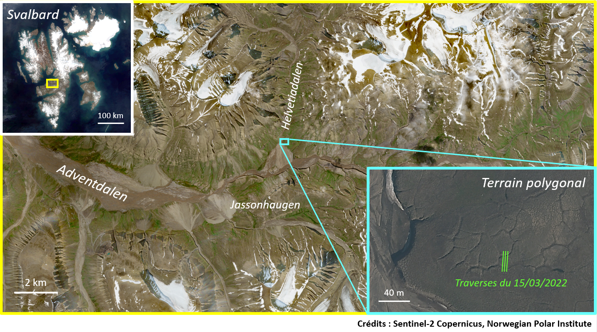

Les terrains **polygonaux** sont une formation géologique classique des plaines arctiques.

Le processus de gel / dégel du proche sous-sol (la zone dite "active") provoque des contraction / décontraction de celui-ci, entrainant des fissures dessinant des "polygones" irrégulier à sa surface.
Ces "polygones" sont clairement visibles sur les images aériennes du terrain, prises pendant l'été.

De l'eau peut s'infiltrer dans ces fissures, jusqu'à atteindre le pergélisol où elle se retrouve piégée sous forme de glace.
Se forme alors au fil des gels / dégels un cône appelé "**coin de glace**".

Si des terrains polygonaux ont déjà été détectés sur Mars, la présence de coins de glace reste débattue.
Dans le cas où de tels formations existeraient sur Mars, elles seraient une **cible de choix pour la recherche de traces de vie**.

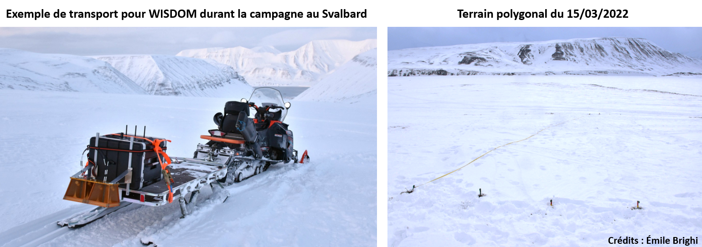

Lors de la campagne au Svalbard de 2022, notre terrain polygonal d'étude était **entièrement recouvert de neige**, d'une épaisseur de 10 cm au milieu des polygones.

Une opération de "**grid**" a été réalisé avec une copie de secours ("flight spare") de WISDOM. 
3 traverses parallèles d'environ **25 m** ont été acquis avec un pas de **20 cm** en travers d'un "polygone", de manière à passer au-dessus des sillons le délimitant.

Nous espérons ainsi observer les sillons sous la neige, et potentiellement détecter un "**coin de glace**" en-dessous. 

Ce fichier nous servira d'exemple pour construire notre **chaîne de traitement des données WISDOM**.

|Nota Bene|
|:-|
|En réalité, les données WISDOM sont enregistrées spectre par spectre dans des fichiers binaires séparés, et non pas rassemblées dans un seul fichier HDF5.|
|Chaque fichier contient également des métadonnées qui ne vous sont pas fournies ici.|
|Pour les besoins de ce TP, nous avons donc fait en sorte de vous faire manipuler un format utile, et simplifié le contenu des données WISDOM.|

### Lecture du fichier

## Analyse spectrale

### FFT

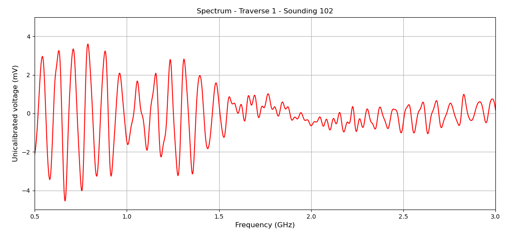

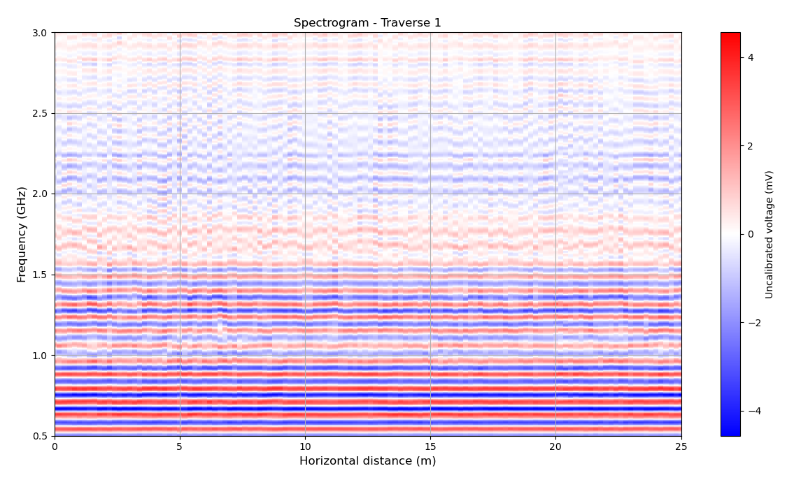

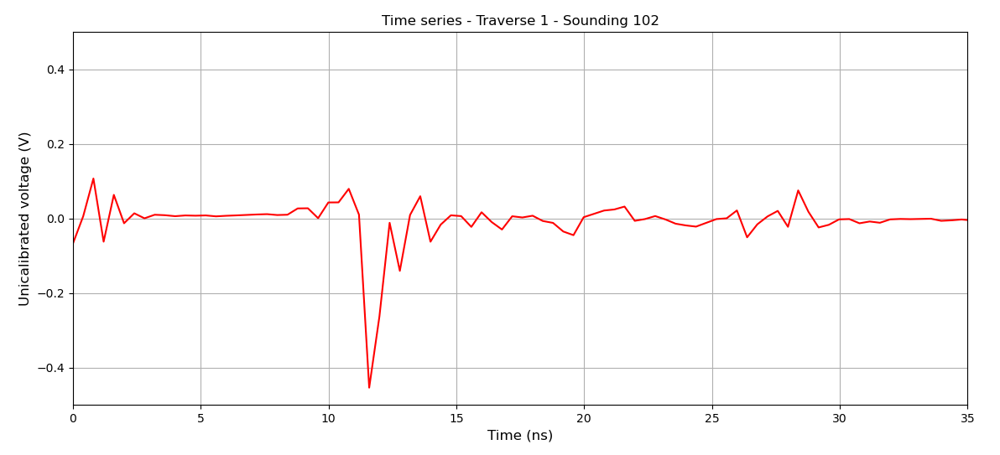

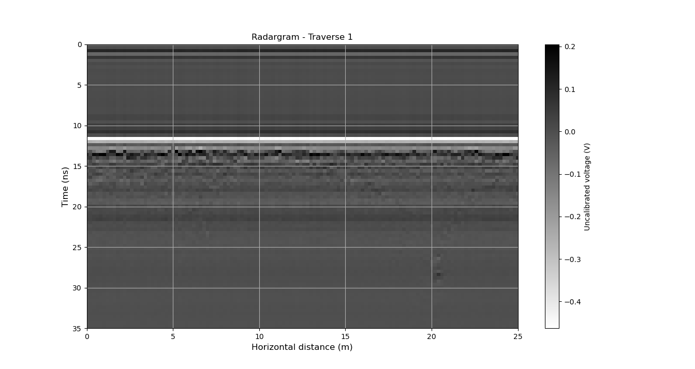

### Mesure d'espace libre

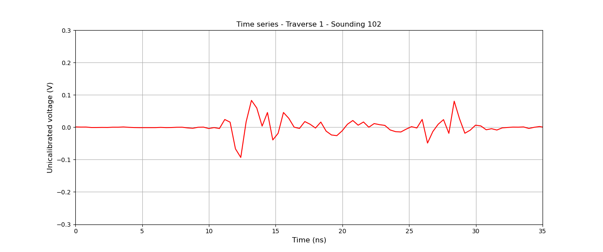

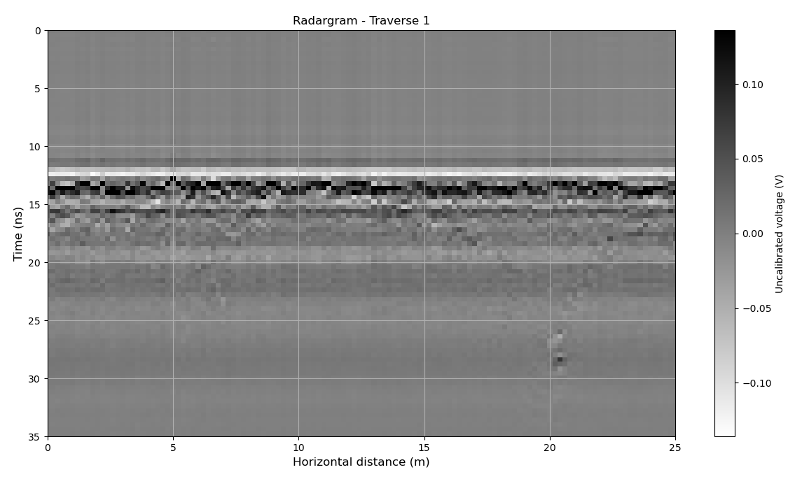

### Zero-padding

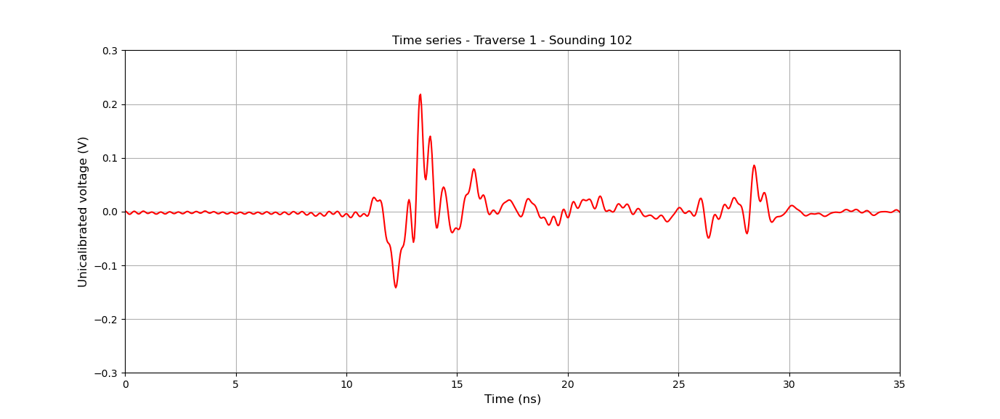

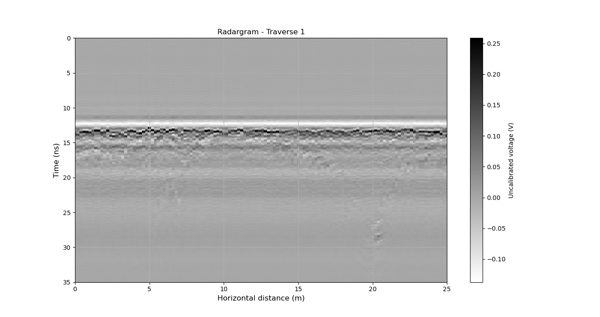

### Fenêtrage

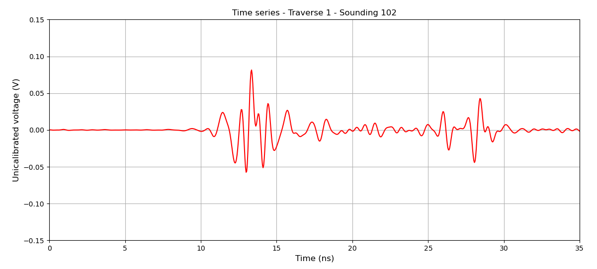

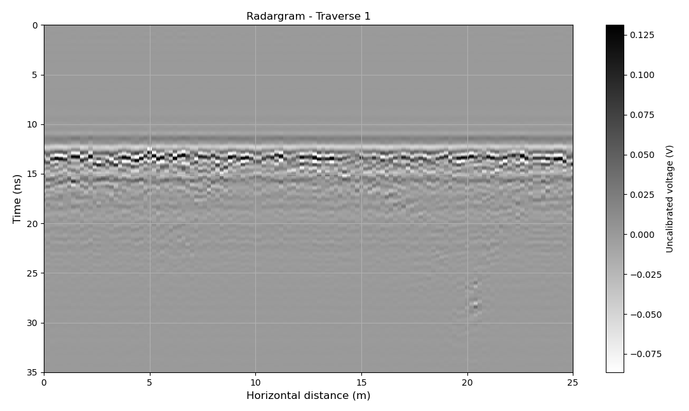

## Amélioration de la lisibilité

### Filtrage horizontal

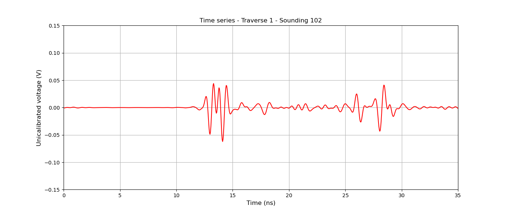

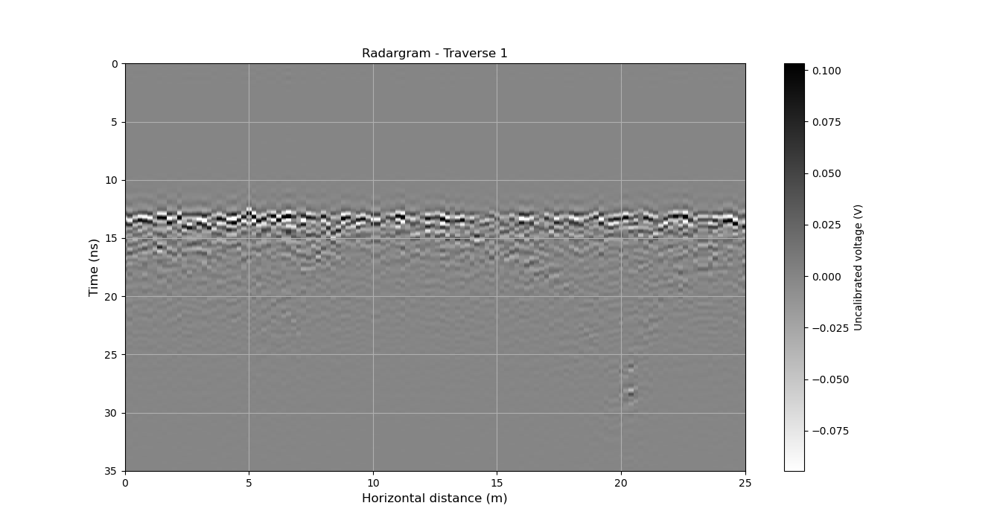

### Gain vertical

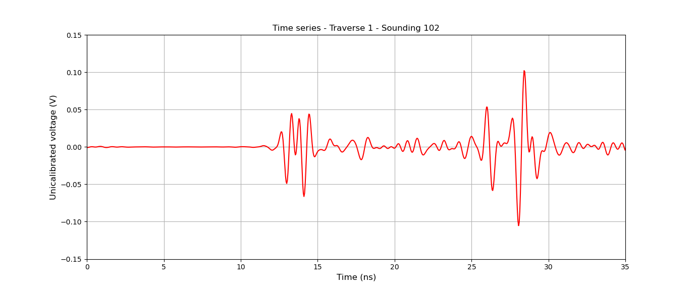

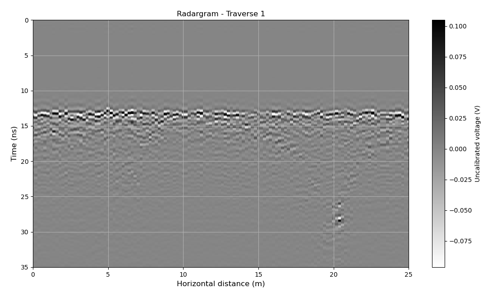

### Interpolation horizontale

## Filtrage fréquentiel

### Filtres passe-haut et passe-bas

### Zoomer sur une région du radargramme

## Interprétation géophysique

### Détection de pics

### Mesure de la permittivité de surface

### Estimation de la profondeur

### Coins de glace ?

## Exportation du résultat

## Conclusion