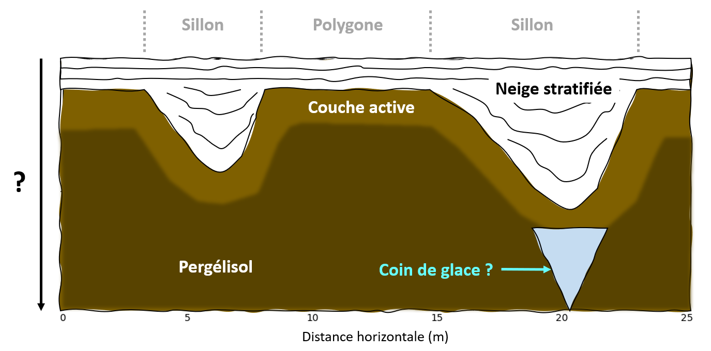
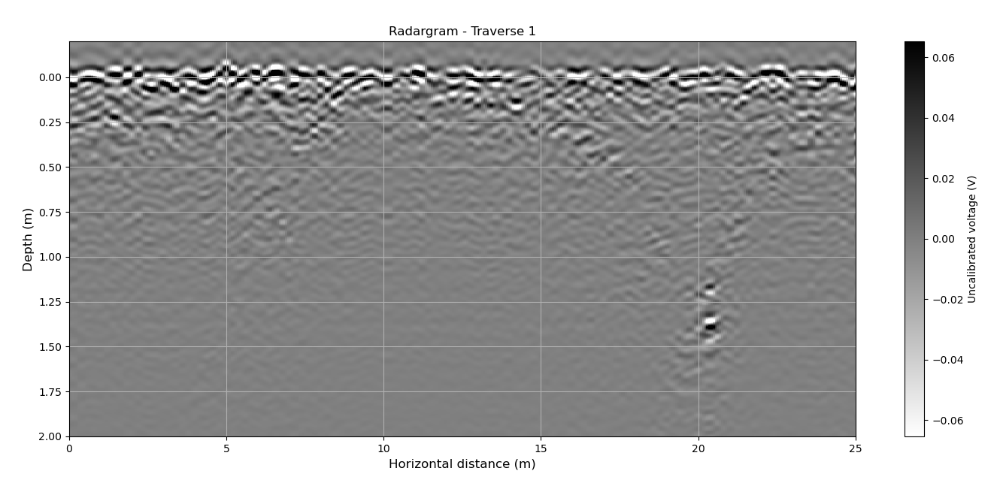

# WISDOM : radar à pénétration de sol pour l'étude du sous-sol martien

_"On a bien réfléchi et on s'est dit que le Graal, il devait sûrement être enterré. [...] Donc, par association d'idées, s'il est enterré, la meilleure chose à faire, c'est de creuser. [...] Après, on s'est posé la question de la profondeur. [...] On est partis sur trois pieds et demi."_

**Alexandre Astier, Kaamelott livre I, épisode 77 : Le Forage**

## Contexte scientifique

En 2030, le rover de la mission **ExoMars** (ESA), nommé "Rosalind Franklin", explorera le site d'Oxia Planum **à la recherche de potentielles traces d'une vie passée sur Mars**.

Dans l'hypothèse ou la vie serait apparue sur Mars lorsqu'elle était habitable, des milliards d'années d'exposition à des conditions hostiles (radiations et oxydation) en auront fait disparaitre toute trace à sa surface.
En revanche, on peut espérer qu'**à quelques mètres de profondeur dans le sous-sol**, qui n'a pas bougé faute d'activité tectonique, **de telles traces de vie auraient été préservées**.

C'est pourquoi le rover d'ExoMars sera le tout premier équipé d'une **foreuse** capable de récolter des échantillons **jusqu'à 2 m** dans le sous-sol martien.
Ces échantillons seront remontés dans le corps du rover, où une suite d'instruments pourra les analyser à la recherche de bio-marqueurs.

_Mais comment savoir où creuser ?_

Les forages seront longs et gourmands en énergie, on veut éviter d'abimer la foreuse sur de la roche trop dure, et le nombre de tubes à échantillons est limité.
Il est donc capital pour la mission d'**avoir un a priori sur le sous-sol avant de creuser**.

C'est là qu'interviendra le **radar à pénétration de sol** (ou "géoradar") **WISDOM**, développé au LATMOS.

Il s'agit d'un instrument qui sera capable de révéler la **structure** des premiers mètres du sous-sol martien, et de donner des indices sur sa **composition**.
Avant toute opération de forage, WISDOM sondera le proche sous-sol pour déterminer si un site est **intéressant scientifiquement** et **sans danger pour la foreuse**.
Il donnera aussi un **contexte géophysique** aux échantillons récoltés.

Les **antennes** de WISDOM seront situées **à l'arrière** du rover, et pointeront **vers le sol**, à environ 38 cm de la surface.

Pour sonder le sous-sol, un signal électromagnétiques sera envoyé par l'**antenne émettrice** en direction du sol.
A chaque **interface** entre matériaux de **propriétés électriques différentes** dans le sous-sol, une partie de ce signal sera renvoyé vers l'**antenne réceptrice**.

Ce signal sera plus ou moins intense suivant le **contraste de propriétés électriques**, et plus ou moins long à revenir suivant la **distance** entre les antennes et l'interface.

Chaque sondage permettra donc de récupérer un profil d'**amplitudes et de temps de retard des échos reçus**.
En réalisant des sondages à mesure que le rover se déplace, on obtiendra une série de profils pour différentes **distances horizontales** depuis le point de départ.

* A partir des **temps de retard** et de la **distance horizontale**, on obtiendra une 1ère idée de la **structure du sous-sol** (strates, hétérogénéité, inclusions, etc.), mais sans réelles estimations de profondeurs.

* A partir des amplitudes des échos, le contraste de **propriétés électriques** à l'interface entre 2 couches du sous-sol pourra être estimé, donnant une **indication de la composition** des différentes strates (roches volcaniques, roches sédimentaires, glace, etc.).

* La vitesse des ondes électromagnétiques dans un matériau dépendant en 1ère approximation de sa **permittivité diélectrique** $\epsilon$, on pourra alors convertir les temps de retard des échos en **profondeurs** des interfaces.

Il est prévu que WISDOM réalise des sondages **à intervalles réguliers** de 10 cm le long de **lignes droites**, un opération que l'on appelle "**traverses**".
Ainsi, les sondages obtenus permettront de visualiser une "coupe" du sous-sol le long de cet axe.

Afin d'ajouter une 3ème dimension à l'étude d'un site donné, il est également prévu que WISDOM réalise jusqu'à **3 traverses en parallèle**, une opération que l'on appelle "**grid**".
Les 3 vues en "coupe" obtenues permettront alors d'obtenir une visualisation quasi-3D du sous-sol.

WISDOM est un radar **SFCW** ("Stepped Frequency Continuous Wave"), ce qui signifie qu'il n'émet pas une impulsion comme ROXI, mais des **signaux harmoniques continus de fréquences croissantes**, avec un pas régulier.

Pour chaque fréquence, le radar reçoit en retour un signal de même fréquence, résultant de l'interférence des différents échos aux différentes interfaces dans le sous-sol.
Son amplitude et sa phase seront enregistrés par l'instrument.

Ce type de radar fonctionne donc en **domaine fréquentiel** : avec ses mesures, il reconstruit l'**équivalent fréquentiel** de la **réponse impulsionnelle** du milieu sondé.
La **transformée de Fourier** des amplitudes et phases obtenues pour les différentes les fréquences permet de reconstituer la **série temporelle** qu'aurait obtenu un **radar impulsionnel équivalent** en sondant le même sous-sol.

C'est pourquoi on parle de "**spectres**" pour désigner les acquisitions de WISDOM pour un sondage donné.
La série temporelle obtenue après transformée de Fourier correspondra aux **échos** reçus pour différents **temps de retards**.

Cette méthode permet d'obtenir un radar nécessitant **moins de puissance**, avec des **signaux plus simples** à générer, ayant un **rapport signal / bruit** et une **dynamique meilleure** qu'un radar impulsionnel de résolution équivalente.
Bref, un instrument **plus compact** et **moins consommateur** en puissance : de gros avantages pour un instrument spatial !

|Nota Bene|
|:-|
|Un radar SFCW classique construit un complexe I/Q contenant les informations d'amplitude et de phase des signaux reçus pour chaque fréquence.|
|Mais ceci nécessite 2 chaînes d'acquisitions distinctes.|
|Par soucis de compacité de l'instrument, WISDOM ne mesure que la partie réelle I du signal.|
|Nous verrons dans la suite comment faire une analyse spectrale d'un signal réel.|

Les données WISDOM consistent donc en des spectres acquis à intervalles réguliers de distance, pour former une matrice 2D appellée "**spectrogramme**".

Après transformation de chaque spectre en série temporelle, on obtient une représentation des échos reçus en fonction du temps pour les différents sondages d'un traverse, appelé "**radargramme**".
Comme mentionné précédemment, l'axe des temps de retards pourra être converti en **profondeurs**, afin d'obtenir une vue en "coupe" du sous-sol.

3 radargrammes acquis en parallèle constitueront une **grid** WISDOM.

Lors de la mission ExoMars, il est prévu qu'une opération **grid** WISDOM soit réalisée à proximité d'un **affleurement** rocheux d'intérêt : une **roche sédimentaire argileuse** qui semble ressortir du régolith de surface.
Une telle roche, formée à l'époque où Mars était encore habitable, pourrait renfermer des **traces d'une hypothétique vie passée**.

Les 3 vues en coupes obtenues grâce à WISDOM pourront confirmer si cet affleurement rocheux **s'enfonce jusqu'à 2 m** dans le sous-sol, profondeur nécessaire à la **préservation de bio-marqueurs**.
Si tel est le cas, l'équipe WISDOM pourra indiquer **où creuser** pour récupérer **un échantillon** de cette roche.

Voici les caractéristiques du radar WISDOM :

|Caractéristique                                |Valeur       |
|:---------------------------------------------:|:-----------:|
|Fréquences d'émission                          |0.5 à 3 GHz  |
|Pas de fréquence d'émission                    |2.5 MHz      |
|Nombre de pas de fréquence                     |1001         |
|Durée d'un pas de fréquence                    |200 µs       |
|Puissance d'émission                           |1 mW typique |
|Gain des antennes                              |0 dBi minimum|
|Résolution en distance dans le vide            |6 cm         |
|Distance ambiguë dans le vide                  |30 m         |
|Résolution en distance typique dans le sous-sol|3 cm         |
|Portée typique dans le sous-sol                |3 m          |

Pour plus d'informations : [site de WISDOM](https://www.wisdom-radar.eu).

|Nota Bene|
|:-|
|Une particularité de WISDOM est qu'il s'agit d'un radar **polarimétrique**.|
|En réalité, il ne possède non pas 2 mais 4 antennes, lui permettant d'émettre et de recevoir dans **2 polarisations linéaires**.|
|Cette information supplémentaire permettra entre autre d'étudier la rugosité des interfaces dans le sous-sol.|
|Pour les besoins de ce TP, nous avons simplifié le contenu des données en ne laissant qu'une seule des 4 configurations polarimétriques possibles.|

## Objectifs

Lors de ce tutoriel, nous allons programmer une **chaîne de traitement des données de WISDOM** sous la forme d'un **projet Python**, que nous utiliserons pour obtenir une **interprétation géophysique** classique.

Ce projet Python devra contenir des fonctions pour :

* Importer des données WISDOM à partir d'un fichier HDF5 tel que celui qui vous sera fourni.

* Convertir en radargrammes les traverses de spectres (spectrogrammes) acquis par le radar, en compensant les effets instrumentaux.

* Filtrer les échos parasites horizontaux.

* Appliquer un gain vertical pour compenser les pertes dans le sous-sol.

* Estimer la permittivité diélectrique de la 1ère couche du sous-sol à partir de la calibration du radar, et en déduire la conversion des temps de retard en profondeurs.

* Exporter les radargrammes obtenus sous la forme d'un fichier HDF5.

Créez le dossier de votre projet, et structurez-le avec des sous-dossiers et des fichiers vides pour l'instant.

**Pour faire simple, n'ajouterons pas de tests ou de documentation à notre projet Python.**

|Nota Bene|
|:-|
|Il est à noter que notre exemple ici a été grandement simplifié pour les besoins de ce TP.|
|Certains traitements, tels que la correction de l'effet de la température, ont déjà été appliqués aux données fournies.|
|De plus, lors de l'interprétation, nous allons faire des hypothèses simplificatrices sur les propriétés électriques du sous-sol, et la propagation des signaux WISDOM à travers celui-ci.|

## Importation des données

### Exemple de données WISDOM

Vous trouverez un exemple de fichier de **données WISDOM** au format **HDF5** [ici](https://github.com/NicOudart/UVSQ_M2_NewSpace_TP_signal/blob/master/example/WISDOM_20220315.h5).

On considérera qu'un fichier de données WISDOM issu d'une opération de "**grid**" contient toujours :

* `frequency_axis` : un "Dataset", vecteur de dimension 1001, contenant l'**axe des fréquences** (Hz) associé aux spectres WISDOM.

* `free_space` : un "Dataset", vecteur de dimension 1001, contenant un spectre réel (homogène à des volts) acquis dans une situation de "d'**espace libre**".
Cette acquisition nous servira lors du traitement de nos données.

* `calibration` : un "Dataset", vecteur de dimension 1001, contenant un spectre réel (homogène à des volts) acquis lors d'un **étalonnage** sur plaque métallique.
Cette acquisition nous servira lors de l'interprétation de nos données.

* `traverse_1`, `traverse_2` et `traverse_3` : 3 "Groups" pour les **3 "traverses"** de la "grid", contenant chacun un "Dataset" nommé `horizontal_distance_axis`, vecteur correspondant à l'axe des **distances horizontales** parcourues par WISDOM (m) pour ce "traverse", et un "Dataset" nommé `data`, matrice 2D correspondant au **spectrogramme** acquis pour ce "traverse". 

Ces données ont été acquises le **15/03/2022**, sur un **terrain polygonal** de la vallée d'**Adventdalen**, lors d'une campagne de test de WISDOM au **Svalbard**.

Les terrains **polygonaux** sont une formation géologique classique des plaines arctiques.

Le processus de gel / dégel du proche sous-sol (la zone dite "active") provoque des contraction / décontraction de celui-ci, entrainant des fissures dessinant des "polygones" irrégulier à sa surface.
Ces "polygones" sont clairement visibles sur les images aériennes du terrain, prises pendant l'été.

De l'eau peut s'infiltrer dans ces fissures, jusqu'à atteindre le pergélisol où elle se retrouve piégée sous forme de glace.
Se forme alors au fil des gels / dégels un cône appelé "**coin de glace**".

Si des terrains polygonaux ont déjà été détectés sur Mars, la présence de coins de glace reste débattue.
Dans le cas où de tels formations existeraient sur Mars, elles seraient une **cible de choix pour la recherche de traces de vie**.

Lors de la campagne au Svalbard de 2022, notre terrain polygonal d'étude était **entièrement recouvert de neige**, d'une épaisseur de 10 cm au milieu des polygones.

Une opération de "**grid**" a été réalisé avec une copie de secours ("flight spare") de WISDOM. 
3 traverses parallèles d'environ **25 m** ont été acquis avec un pas de **20 cm** en travers d'un "polygone", de manière à passer au-dessus des sillons le délimitant.

Nous espérons ainsi observer les sillons sous la neige, et potentiellement détecter un "**coin de glace**" en-dessous. 

Ce fichier nous servira d'exemple pour construire notre **chaîne de traitement des données WISDOM**.

|Nota Bene|
|:-|
|En réalité, les données WISDOM sont enregistrées spectre par spectre dans des fichiers binaires séparés, et non pas rassemblées dans un seul fichier HDF5.|
|Chaque fichier contient également des métadonnées qui ne vous sont pas fournies ici.|
|Pour les besoins de ce TP, nous avons donc fait en sorte de vous faire manipuler un format utile, et simplifié le contenu des données WISDOM.|

### Lecture du fichier

La 1ère étape de notre de chaîne traitement sera d'importer les données WISDOM d'un fichier HDF5.

|Ajoutez à votre projet Python une fonction `read`|
|:-|
|Cette section vous donnera les éléments nécessaires pour la compléter.|
|- Entrées :  le chemin d'un fichier HDF5.|
|- Sorties : 9 matrices `numpy`, correspondants aux 9 "Datasets" contenus dans le fichier.|

Pour lire et écrire un fichier HDF5, nous utiliserons la bibliothèque Python `h5py`.

Nous convertirons les "Datasets" contenus dans un fichier en matrices `numpy`.

N'oubliez donc pas d'importer ces 2 bibliothèques avec les commandes suivantes :

~~~
import h5py
import numpy as np
~~~

Pour importer un fichier HDF5 avec `h5py`, on crée un objet `File`.

Voici ce que cela donnerait sur notre exemple :

~~~
hf = h5py.File(".../WISDOM_20220315.h5",'r')
~~~

On peut alors récupérer les différents "Datasets" contenus dans le fichier avec la méthode `get` et leurs noms.
Pour les "Datasets" contenus dans des "Groups", il faudra utiliser `get` pour récupérer chaque "Group", puis à nouveau `get` pour récupérer les "Datasets" de chaque "Group".
On oubliera pas de convertir en matrices `numpy` les "Datasets" récupérés.

Voici ce que pourrait donner la récupération des 9 "Datasets" d'un fichier WISDOM :

~~~
frequency_axis = np.array(hf.get("frequency_axis"))

vect_free_space = np.array(hf.get("free_space"))
vect_calibration = np.array(hf.get("calibration"))

group1 = hf.get("traverse_1")
group2 = hf.get("traverse_2")
group3 = hf.get("traverse_3")

mat_traverse_1 = np.array(group1.get("data"))
mat_traverse_2 = np.array(group2.get("data"))
mat_traverse_3 = np.array(group3.get("data"))

distance_axis_1 = np.array(group1.get("horizontal_distance_axis"))
distance_axis_2 = np.array(group2.get("horizontal_distance_axis"))
distance_axis_3 = np.array(group3.get("horizontal_distance_axis"))
~~~

**Vous pouvez à présent compléter votre fonction `read`**.

Appliquez votre fonction à notre fichier exemple.

_Les dimensions des matrices récupérées sont-elles bien celles attendues ? Le type des données également ? Quelle est la longueur de chaque traverse ?_

Petite question pour voir si vous avez bien compris le fonctionnement du format HDF5 :

_A votre avis, pourquoi avoir rangé l'axe des distances horizontale dans le "Group" de chaque traverse, et pas l'axe des fréquences ?_

## Analyse spectrale

La 2nde étape de notre de chaîne traitement sera de générer des radargrammes pour chaque traverse contenu dans les données WISDOM récupérées.

|Ajoutez à votre projet Python une fonction `FFT`|
|:-|
|Cette section vous donnera les éléments nécessaires pour la compléter.|
|- Entrées : 4 matrices `numpy` contenant les 3 spectrogrammes des 3 "traverses" et l'axe des fréquences, telles que retournées par la fonction `read`.|
|- Sorties : 4 matrices `numpy`, contenant les 3 radargrammes des 3 "traverses", et l'axe des temps de retard correspondant.|

Afin d'obtenir des radargrammes interprétables, nous appliquerons dans cette fonction 3 techniques en amont de la  transformée de Fourier :

* Le retrait d'une mesure d'**espace libre**, afin de réduire les échos parasites provenant de l'instrument et son support.

* Le **zero-padding**, afin d'avoir des radargrammes interpolés verticalement.

* Le **fenêtrage**, afin d'éviter les problèmes liés aux "lobes secondaires".

### Nature des données

Dans un 1er temps, nous allons nous intéresser à la nature des données dont nous disposons.

Importez la bibliothèque `matplotlib`, qui va nous servir à faire des affichages graphiques :

~~~
import matplotlib.pyplot as plt
~~~

Essayons tout d'abord d'afficher un spectre issu de nos données.

Prenons le 103ème sondage du 1er "traverse", et regardons le spectre mesuré.
Affichons ce signal avec des commandes Python de ce genre :

~~~
plt.figure()
plt.plot(frequency_axis,mat_traverse_1[102],'r-')
plt.xlabel('Frequency (Hz)',fontsize=12)
plt.ylabel('Unicalibrated voltage (V)',fontsize=12)
plt.title('Spectrum - Traverse 1 - Sounding 102',fontsize=12)
plt.grid()
plt.show()
~~~

On obtient alors la courbe suivante :

On voit nettement qu'un spectre WISDOM est un signal réel **périodique**.

Un spectre WISDOM correspond dans le domaine temporel à une serie d'impulsions renvoyées par les différentes interfaces du sous-sol, reçues pour différents temps de retard par rapport à l'émission.
On s'attend donc à obtenir une **somme de sinusoïdes**, dont la fréquence est d'autant plus élevée que le temps de retard de l'écho est grand.

D'où l'intérêt de vouloir réaliser une **analyse spectrale** de ce signal, afin de séparer temporellement les différents échos reçus par le radar.

|Nota Bene|
|:-|
|Considérer les spectres WISDOM comme une somme de sinusoïdes est en réalité une approximation de la réalité.|
|En effet, des limitations techniques font que WISDOM n'émet pas tout à fait les différentes fréquences avec la même puissance.|
|Ensuite, les pertes dans le sous-sol (absorption et diffusion) dépendent de la fréquence.|
|Tout ceci explique le fait que les basses fréquences ont l'air d'avoir une amplitude plus élevée que les hautes fréquences.|

Pour vérifier que l'on retrouve bien un signal périodique pour chaque spectre du 1er traverse, nous pouvons aussi afficher le spectrogramme.

Vous pouvez réaliser cet affichage avec des commandes Python de ce genre :

~~~
plt.figure()
plt.pcolormesh(distance_axis_1,frequency_axis,mat_traverse_1.T,cmap='bwr',vmin=-np.percentile(np.abs(mat_traverse_1),99.9),vmax=np.percentile(np.abs(mat_traverse_1),99.9))
plt.xlabel('Horizontal distance (m)',fontsize=12)
plt.ylabel('Frequency (Hz)',fontsize=12)
plt.colorbar(label='Uncalibrated voltage (V)')
plt.title('Spectrogram - Traverse 1',fontsize=12)
plt.grid()
plt.show()
~~~

On obtient alors l'affichage graphique suivant, qui confirme ce que nous avions observé sur le 103ème sondage :

On voit que la somme de sinusoïdes n'est pas tout à fait la même pour chaque sondage, signe que la pronfondeur des différentes interfaces détectées varie avec la distance horizontale.

Avant de réaliser les conversions en domaine temporel, posez-vous les questions suivantes :

_Quel temps de retard maximal pourra mesurer WISDOM ? Retrouvez-vous bien la distance ambiguë dans le vide donnée précédemment ? A votre avis, d'où vient la différence ?_

_Quel sera la résolution temporelle de WISDOM ? Retrouvez-vous bien la résolution dans le vide donnée précédemment ?_

_Que risque-t-il de se passer si WISDOM détecte un écho d'une interface plus lointaine que sa distance ambiguë ?_

### FFT réelle avec Numpy

Comme pour le TP précédent, nous allons utiliser la "**Fast Fourier Transform**" (FFT).
Cependant, à la différence des données ROXI qui étaient complexes, les spectres WISDOM sont **réels**.

Hors, la transformée de Fourier d'un signal réel donne un signal complexe **symétrique autour de 0** : la moitié du signal est **redondante**.
Dans notre cas, un sondage en domaine temporel contiendrait les mêmes échos pour des temps de retard positifs et négatifs, ce qui n'a pas de sens physique.

Pour éviter ce problème, la bibliothèque `numpy` propose une implémentation spéciale de la FFT nommée `rfft`, **adaptée à l'analyse spectrale de signaux réels**.
Elle ne retourne que la partie positive du signal après FFT, évitant ainsi la redondance.

|Nota Bene|
|:-|
|On en déduit facilement que la distance ambiguë de WISDOM dans le vide est 2 fois plus courte que si WISDOM mesurait des spectres complexes.|

N'oubliez pas d'importer la bibliothèque :

~~~
import numpy as np
~~~

Pour déterminer l'axe des temps de retard qui ira avec nos sondages WISDOM, on peut utiliser la méthode `fft.rfftfreq` de `numpy`, qui est l'adaptation pour les signaux réels de `fft.fftfreq` vue au TP précédent.

On pourra donc utiliser des commandes Python de ce genre pour générer notre axe :

~~~
df = frequency_axis[1]-frequency_axis[0]
time_axis = np.fft.rfftfreq(len(frequency_axis),d=df)
~~~

On rappelle que la sortie d'une transformée de Fourier est une série de **nombres complexes**, contenant les informations d'**amplitude** et de **phase** des échos reçus.

* Les amplitudes des échos sont d'autant plus grandes que le **contraste de permittivité diélectrique** à une interface est fort.

* Les décalages de phase des échos indique si l'on passe d'**un milieu de permittivité diélectrique plus faible à un milieu de permittivité diélectrique plus haute**, ou l'**inverse**.

C'est pourquoi on choisi en général d'afficher la **partie réelle** du radargramme d'un radar à pénétration de sol, afin de visualiser à la fois les variations d'amplitude et de phase.
Le **module** pourra être utilisé pour les mesures de réflectivité.

L'amplitude du spectre en sortie de la FFT sera homogène à une tension.

On utilisera la méthode `fft.rfft` de `numpy`, avec une commande similaire à celle-ci :

~~~
sounding_1_132 = np.fft.rfft(spectrum_1_132)
~~~

Pour obtenir la partie réelle de la série temporelle, il suffira d'utiliser la commande :

~~~
sounding_1_132_real = np.real(sounding_1_132)
~~~

Et pour le module :

~~~
sounding_1_132_real = np.abs(sounding_1_132)
~~~

**Sauf mentionné autrement, nous considèrerons dans la suite de ce TP que nous récupérons la partie réelle du signal**.

|Nota Bene|
|:-|
|Les tensions obtenues ici ne sont pas calibrées.|
|Nous nous servirons d'une mesure de calibration de l'amplitudes des échos de surface, pour l'interprétation.|

Si vous appliquez la FFT au 103ème sondage du 1er "traverse", vous obtiendrez la série temporelle suivante :

On observe clairement des échos dès le début du sondage, entre 0 et 2.5 ns, ce qui est étrange étant donné que les antennes radar sont à 38 cm de la surface.
Ensuite, on voit un écho intense à environ 12 ns, que l'on pourrait identifier comme étant l'écho de surface.
Enfin, on devine des échos entre 15 et 30 ns, correspondant probablement à des échos du sous-sol.

Afin d'aider à identifier ces échos, affichons le radargramme complet du 1er "traverse".

Pour ce faire, une fois le radargramme du "traverse" récupéré dans une matrice `numpy` nommée `mat_radargram_1`, vous pouvez utiliser des commandes de ce genre :

~~~
plt.figure()
plt.pcolormesh(distance_axis_1,time_axis,mat_radargram_1.T,cmap='binary',vmin=-np.percentile(np.abs(mat_radargram_1),99.9),vmax=np.percentile(np.abs(mat_radargram_1),99.9))
plt.gca().invert_yaxis()
plt.xlabel('Horizontal distance (m)',fontsize=12)
plt.ylabel('Time (s)',fontsize=12)
plt.colorbar(label='Uncalibrated voltage (V)')
plt.title('Radargram - Traverse 1',fontsize=12)
plt.grid()
plt.show()
~~~

Vous obtiendrez alors un affichage graphique similaire à celui-ci :

On observe alors que les échos de début de sondage entre 0 et 2.5 ns, ainsi que l'écho intense à 12 ns sont constants tout le long du radargramme.
On en déduit qu'il s'agit d'**effets instrumentaux** : 

* Les échos entre 0 et 2.5 ns correspondent au "**couplage interne**" : des échos liés à des problèmes d'aptation d'impédance au sein des circuits / câbles de l'instrument.

* L'écho intense à 12 ns correspond au "**couplage direct**" : le signal émis est quasi-directement capté par l'antenne de réception.

Des traits horizontaux, correspondant à des **réflexions multiples** des couplages interne et direct, dérangent la visualisation des échos provenant du sous-sol entre 15 et 30 ns.

Afin de réduire ces effets, nous allons compenser une **mesure d'espace libre**, **en amont** de la FFT.

### Mesure d'espace libre

Lorsque l'on veut compenser les effets instrumentaux d'une mesure, on utilise classiquement ce que l'on appelle un "blanc".

Pour un radar, il s'agit d'une mesure "d'**espace libre**", c'est-à-dire sans aucune cible devant les antennes.
Le sondage obtenu ne contiendra alors que les échos provenant du **couplage interne** et du **couplage direct**.

En soustrayant cette mesure d'espace libre notre 103ème spectre du 1er "traverse", nous obtenons après FFT la série temporelle suivante :

On voit que le **couplage interne** a totalement disparu.
Le **couplage direct** a été fortement réduit, mais n'a pas été complètement supprimé.

Ceci est lié au fait que le couplage interne est très stable d'une mesure à l'autre, le rendant facilement compensable.
Le couplage direct quant à lui varie légèrement avec la température (qui n'est jamais parfaitement compensée) et peut être influencé par la surface, ce qui rend sa compensation plus difficile.

Néanmoins, **les échos provenant de la sous-surface ressortent plus clairement**.

Si on soustrait la mesure d'espace libre à tous les spectres du 1er "traverse", on obtient après FFT le radargramme suivant :

Des structures de la sous-surface commencent à apparaitre, mais des parasites horizontaux perturbent toujours un peu la lecture du radargramme.
Nous verrons dans la suite du TP comment les compenser.

Le radargramme a un aspect "pixélisé", qui est lié au fait qu'ici la **durée de l'impulsion équivalente** en domaine temporel de WISDOM est **exactement égale à 1 pixel**.

Nous allons voir comment faire pour obtenir des sondages un peu plus "lissés", afin d'améliorer leur lisibilité.

|Nota Bene|
|:-|
|La durée de l'impulsion équivalente d'un radar fonctionnant en domaine fréquentiel est égale à l'inverse de la bande de fréquences de l'instrument.|
|WISDOM fonctionnant entre 0.5 et 3 GHz, sa largeur de bande est de 2.5 GHz, et donc la durée de son impulsion équivalente est de 0.4 ns.|
|La résolution d'un signal obtenu en sortie de la FFT dépend du nombre d'échantillons fournis en entrée.|

### Zero-padding

Si nous appliquons la FFT à un spectrum WISDOM contenant **1001 échantillons**, la série temporelle obtenue contiendra **également 1001 échantillons**.
Le spectre mesuré faisant 2.5 GHz de large, on en déduit que cette série temporelle aura un pas de 0.4 ns.

Pour augmenter le nombre d'échantillons renvoyés par la FFT, on peut augmenter le nombre d'échantillons dans un spectre WISDOM **en ajoutant des zéros à la fin**.
C'est ce que l'on appelle le "**zero-padding**".

Par exemple, si on complète un spectre WISDOM de 1001 échantillon, en ajoutant 1001 zéros à la fin, on obtient 2002 échantillons en sortie de la FFT.
Le pas de la série temporelle obtenue sera alors de 0.2 ns.

Par contre, en ajoutant des zéros nous n'avons ajouté aucune information au spectre : la largeur de bande de WISDOM reste de 2.5 GHz.
La largeur de l'impulsion équivalente reste donc de 0.4 ns.

Le pas de la série temporelle a donc été **divisé par 2**, mais la **résolution** des sondages WISDOM (c'est-à-dire leur capacité à séparer 2 impulsions) **reste la même**.

On en déduit que le "**zero-padding**" agit comme une **interpolation verticale** des radargrammes : il permet de lire plus facilement le temps de retard des échos reçus, mais ne permet pas de mieux les séparer.

Avec l'implémentation `numpy` de la FFT, il n'est pas nécessaire d'ajouter des zéros à la fin de notre spectre pour faire du zero-padding.
Il suffit d'ajouter un second paramètre en entrée pour définir le nombre d'échantillons que l'on veut en sortie de la FFT.

Pour obtenir une série temporelle contenant 10 fois plus d'échantillons que notre spectre, il suffit donc d'adapter votre commande Python de la manière suivante :

~~~
sounding_1_132 = np.fft.rfft(spectrum_1_132,10*len(spectrum_1_132))
~~~

**Attention ! Il faut aussi adapter l'axe temporel qui va avec !**

_Quel sera le pas de cette série temporelle ?_

**Pour votre fonction `FFT`, vous pouvez soit ajouter le nombre d'échantillons désiré comme une entrée de la fonction.**

En appliquant la FFT avec "zero-padding" au 103ème sondage du 1er traverse, vous devriez obtenir la série temporelle suivante :

On observe bien ce que l'on attendait : le temps de retard des "pics" correspondants aux impulsions reçues sont beaucoup plus facile à lire.

Mais il est clair que ces pics étaient déjà visibles sur le spectre à 1001 échantillons, et que nous n'en avons pas fait apparaitre de nouveaux.
Nous n'avons donc apporté aucune information spectrale, juste interpolé le spectre.

Par contre, apparaissent des petits échos parasites, qui sont le plus nettement visibles entre 0 et 11 ns.

Vous pouvez appliquer le "zero-padding" à l'intégralité du radargramme du 1er traverse, pour voir si on retrouve cet artefact dans d'autres sondages.
Vous devriez alors obtenir le graphique suivant :

On observe bien cet effet sur l'intégralité du radargramme.
Il s'agit de ce que l'on appelle des "**lobes secondaires**", un effet classique lorsque l'on réalise une analyse spectral d'un signal fini.

Nous allons voir comment compenser cet effet.

### Fenêtrage

En théorie, la transformée de Fourier d'une **sinusoïde complexe** donne un spectre contenant **un unique pic** (ou "Dirac"), à la fréquence correspondante.

Dans la réalité, nous ne pouvons traiter que des signaux **finis** et **discrets**.

Lorsque l'on applique une FFT à un signal, 2 phénomènes apparaissent alors :

* "**Aliasing**" (ou "repliement de spectre): échantillonner revient dans le domaine fréquentiel à une convolution par un "peigne de Dirac", où chaque "Dirac" est espacé de la fréquence d'échantillonnage $F_e$.
On obtient donc un spectre répétant les composantes fréquentielles du signal tous les $F_e$.
Si le signal temporel contient des fréquences supérieures à $F_e/2$, il y aura chevauchement entre ces répétitions dans le spectre.

* "**Spectral leakage**" : avoir un signal fini revient à multiplier un signal infini par une fenêtre rectangulaire.
La transformée de Fourier d'une fenêtre rectangulaire étant un sinus cardinal, ceci revient dans le domaine fréquentiel à une convolution par un sinus cardinal.
Pour chaque composante fréquentielle du signal, nous obtenons donc un sinus cardinal, avec un "lobe principal" et des "**lobes secondaires**".

C'est ce 2nd phénomène qui cause l'artefact que nous observons dans notre radargramme.

Il est particulièrement problématique ici, car un "lobe secondaire" pourrait être pris par erreur pour un écho provenant du sous-sol.

C'est pourquoi on doit appliquer un "**fenêtrage**" à un spectre WISDOM **avant FFT**.

L'idée est d'adoucir les discontinuités sur les bord de notre spectre fini, en le multipliant par un type de fonction appelée "**fenêtre d'apodisation**".
Parmi les fenêtres connues, on peut citer Hann, Hamming et Blackman.

Le choix d'une fenêtre est toujours un compromis entre **résolution** et réduction des "**lobes secondaires**" :

* Trop "adoucir" les bords du spectre revient à réduire la bande de fréquences effective de l'instrument, et donc à **dégrader sa résolution**.

* Ne pas assez "adoucir" les bords du spectre revient à prendre le risque d'avoir de **confondre des lobes secondaires avec des échos**.

Il existe des implémentations `numpy` des différentes fenêtres d'aposation.
Elle portent en général simplement le nom de la fenêtre, et prennent en entrée le nombre d'échantillons dans le spectre.

Voici comment adapter notre commande pour appliquer la **fenêtre de Hann** à notre spectre WISDOM avant FFT :

~~~
sounding_1_132 = np.fft.rfft(spectrum_1_132*np.hanning(len(spectrum_1_132)),10*len(spectrum_1_132))
~~~

|Nota Bene|
|:-|
|Vous avez peut-être remarqué que la fenêtre de "Hann" est nommée "Hanning" par `numpy`.|
|Il s'agit d'une erreur classique : comme il existe une fenêtre de "Hamming", et que beaucoup d'anglophones pensent qu'il s'agit d'un verbe au gérondif, le fenêtrage de "Hann" est parfois nommé "Hanning".|
|En réalité, "Hamming" est le nom d'un mathématicien américain : il n'existe pas de fenêtre de "Ham".|

**Pour votre fonction `FFT`, vous pouvez aussi utiliser la fenêtre de Hann, qui est souvent la fenêtre choisie par défaut.**

En appliquant la FFT avec fenêtrage de Hann au 103ème sondage du 1er traverse, vous devriez obtenir la série temporelle suivante :

Comme attendu, on voit que les "lobes secondaires" ont quasiment disparu.

Par contre, la durée des impulsions reçue a clairement augmenté, et donc la résolution temporelle du radar a été dégradée.
Encore une fois, il s'agit d'un compromis.

Si vous affichez le radargramme complet du 1er traverse, vous pourrez apprécier l'amélioration : 

On distingue à présent plutôt bien la surface entre 13 et 14 ns, puis des structures du sous-sol jusqu'à presque 30 ns.
Nous discuterons plus tard de leur interprétation.

**Vous pouvez enfin compléter votre fonction `FFT`**.

_Nous remarquons encore quelques lignes horizontales dans le radargramme, que le retrait de la mesure d'espace libre n'a pas éliminé. A votre avis, quelle est leur origine ?_

En théorie, nous pourrions arrêter notre chaîne de traitement ici, et passer à l'interprétation.

Cependant, pour améliorer la **lisibilité** d'un radargramme WISDOM, on ajoute souvent quelques traitements supplémentaires à la chaîne : filtrage horizontal, gain vertical et interpolation horizontale.

Si ces traitements améliorent grandement notre capacité à interpréter visuellement les radargrammes, ils peuvent empêcher certaines interprétations physiques.
Nous pourrons donc choisir ou non de les appliquer suivant notre objectif.

## Amélioration de la lisibilité

Nous allons ajouter 3 traitements optionnels à notre chaîne de traitement des données WISDOM, afin d'améliorer la lisibilité des radargrammes.

Nous les implémenterons sous la forme de 3 fonctions : `horizontal_filter`, `vertical_gain` et `horizontal_interpolation`.

Ces traitements arrivant après la génération du radargramme par `FFT`, ils s'appliquent donc dans le **domaine temporel**.

### Filtrage horizontal

En regardant le radargramme obtenu pour le 1er traverse, nous voyons que de nombreuses lignes horizontales gênent toujours la lecture, malgré le retrait d'une mesure d'espace libre.

Ces "échos parasites" sont donc probablement issus de réflexions multiples entre entre les antennes et le sol, ou entre les antennes et le moyen de transport du radar.

Plusieurs méthodes ont été envisagées par l'équipe WISDOM pour compenser ces parasites.
Dans le cadre de ce TP, nous implémenterons la plus simple d'entre elles : **le retrait d'une moyenne horizontale**.

Il s'agit simplement de calculer la moyenne des amplitudes pour les différentes lignes du radaragramme, et de soustraire le vecteur obtenu à chaque colonne.

_Quelle hypothèse faisons-nous ici sur les échos parasites par rapport aux échos du sous-sol ?_

_Que risque-t-il de se passer si nous avons une interface horizontale dans le sous-sol ?_

_Cette méthode fonctionne-t-elle d'autant plus que le traverse est long ou court ?_

La prochaine étape de notre chaîne de traitement sera donc de soustraire sa moyenne horizontale au radargramme.

|Ajoutez à votre projet Python une fonction `horizontal_filter`|
|:-|
|Cette section vous donnera les éléments nécessaires pour la compléter.|
|- Entrées : 3 matrices `numpy` contenant les 3 radargrammes des 3 "traverses", tels que retournés par la fonction `FFT`.|
|- Sorties : 3 matrices `numpy`, contenant les 3 radargrammes des 3 "traverses", après retrait d'une moyenne horizontale.|

Pour calculer la moyenne d'une matrice selon l'axe horizontal, on peut utiliser une méthode de `numpy` nommée `mean`, avec le paramètre `axis` égal à 0.

Si nous appliquons ce traitement au 103ème sondage du 1er traverse, nous obtenons la série temporelle suivante :

On observe que les échos parasites on presque disparu.
Par exemple, un petit peu avant 20 ns.

Mais on voit aussi que l'écho de la surface semble avoir été un peu déformé.

Si nous appliquons le retrait d'une moyenne horizontale à l'intégralité du radargramme du 1er traverse, nous obtenons le résultat suivant :

On voit en effet que la forme et l'intensité de l'écho de surface semblent avoir été plus ou moins impactées selon les sondages.

On pouvait le deviner : WISDOM se déplaçant à une distance quasi-constante au-dessus de la surface, l'écho de surface est très constant avec la distance parcourue.
On s'attend donc à ce que **l'écho de surface soit impacté par le retrait d'une moyenne horizontale**.

Ceci n'est pas très problématique lorsque l'on n'est intéressé que par les échos de la sous-surface.
Mais dans la suite, nous utiliserons l'intensité de l'écho de surface pour notre interprétation.

Il faudra alors faire attention de réaliser notre interprétation de l'écho de surface **avant le retrait de la moyenne horizontale !**

**Vous pouvez à présent compléter votre fonction `horizontal_filter`**.

|Nota Bene|
|:-|
|Il est a noté que ce traitement est assez spécifique à WISDOM.|
|En effet, la plupart des géoradars terrestres ont leur antennes collées au sol, et donc leur radargrammes ne présentent ni réflexion au niveau du sol, ni réflexions multiples entre les antennes et le sol.|
|Les antennes de WISDOM sont à 38 cm au-dessus de la surface pour des raisons pratiques de déplacement du rover.|

Maintenant que les échos parasites ne gênent plus la lecture de notre radargramme du 1er traverse, on distingue bien mieux la structure du sous-sol.

Par contre, plus les échos viennent de loin dans le sous-sol, plus ils sont faibles comparés à l'écho de surface...

### Gain vertical

Lorsque les ondes électromagnétiques émises par un géoradar se propagent dans le sous-sol, elles sont atténuées par 3 phénomènes différents :

* La **divergence géométrique** du faisceau émit, qui fait diminuer l'amplitude du signal proportionnellement à la distance parcourue.

* L'**absportion** du matériau liée aux pertes diélectriques et de conductivité, qui fait diminuer diminuer l'amplitude du signal exponentiellement.

* La **diffusion** par les hétérogénéités du sous-sol, qui fait aussi diminuer l'amplitude du signal exponentiellement.

Tout ceci fait que les échos seront avec une amplitude d'autant plus faible que leur profondeur d'origine est élevée.

La dynamique nécessaire pour représenter les différents échos d'un radargramme est donc souvent très grande, et il est donc difficile de trouver une échelle de couleur permettant de visualiser tous les échos sans saturation.

C'est pourquoi il est commun pour les radars à pénétration de sol d'appliquer **un gain le long de l'axe vertical des radargrammes**, afin de compenser les pertes, et de faire ressortir les échos profonds.

Nous allons ajouter à notre chaîne de traitement un gain vertical pour compenser les pertes dans le sous-sol.

|Ajoutez à votre projet Python une fonction `vertical_gain`|
|:-|
|Cette section vous donnera les éléments nécessaires pour la compléter.|
|- Entrées : 3 matrices `numpy` contenant les 3 radargrammes des 3 "traverses" tels que retournés par la fonction `FFT`, et les 3 paramètres nécessaires à la fonction de gain que nous voulons implémenter.|
|- Sorties : 3 matrices `numpy`, contenant les 3 radargrammes des 3 "traverses", après application d'un gain selon l'axe vertical.|

En tout rigueur, il faudrait utiliser pour le gain une fonction qui combine compensations linéaire (pertes par divergence) et exponentielle (absorption et diffusion) avec la profondeur, en se basant sur les propriétés du sous-sol.
Malheureusement, nous n'avons pas toujours accès à la composition du sol.

Pour simplifier, dans le cadre de ce TP nous allons utiliser une fonction exponentielle $G$ du temps de retard des échos $t$ :

$G(t) = \left\{
    \begin{array}{ll}
        exp(\alpha \frac{t-t_{min}}{t_{max}-t_{min}}) & \mbox{si } t \in [t_{min},t_{max}] \\
        1 & \mbox{sinon.}
    \end{array}
\right.$

avec $t_{min}$ le temps de retard à partir duquel appliquer le gain (pour compenser les pertes dans le sous-sol, on choisira celui de l'écho de surface), $t_{max}$ le temps de retard au-dela duquel on arrête d'appliquer le gain, et $\alpha$ un coefficient à ajuster.

Pour chaque colonne du radargramme, on multipliera les amplitudes reçues par le radar par le gain $G(t)$.

_A votre avis, pourquoi choisir le temps de retard de l'écho de surface pour $t_{min}$ ?_

_Pourquoi avoir définit un $t_{max}$ ?_

_Que représente physiquement $\alpha$ ?_

Si vous appliquez au 103ème sondage du 1er traverse un tel gain avec $t_{min} = 13 ns$, $t_{max} = 35 ns$ et $\alpha = 1.3$, vous devriez obtenir la série temporelle suivante :

Les échos du sous-sol situés entre 25 et 30 ns ont été fortement amplifiés !

On peut afficher le radargramme complet du 1er traverse, pour apprécier l'amélioration de la lisibilité :

On discerne à présent très bien une interface qui a l'air de plonger entre 15 et 20 m, et de remonter entre 20 et 23 m de distance horizontale.
Nous discuterons plus tard de son interprétation.

**Vous pouvez à présent compléter votre fonction `vertical_gain`**.

Vous pouvez jouer sur la valeur du coefficient $\alpha$ pour tester son effet.

|Nota Bene|
|:-|
|Avec ce traitement, nous avons fait l'hypothèse implicite que les 3 effets de pertes que nous cherchons à compenser sont indépendants de la fréquence du signal.|
|C'est en réalité une approximation, qui n'est pas toujours valide !|
|De manière générale, les hautes fréquences sont plus fortement atténuées que les basses.|
|Notre fonction de gain ne dépendant pas de la fréquence, elle ne pourra jamais compenser parfaitement les pertes dans le sous-sol.|

Vous l'avez sûrement remarqué, notre radargramme a toujours un aspect "pixélisé" selon l'axe horizontal.

Pour atténuer cet effet visuel, nous allons dans la suite appliquer une interpolation horizontale aux radargrammes de WISDOM.

### Interpolation horizontale

Lors de la mission ExoMars, il est prévu que les sondages WISDOM soient acquis avec **un pas horizontal de 10 cm**.
Dans le cas des 3 traverses effectués le 15/03/2022 au Svalbard, les sondages ont été acquis avec **un pas horizontal de 20 cm**.

Dans un proche sous-sol martien typique, on s'attend à ce que les sondages WISDOM aient **une résolution en de l'ordre de 3 cm**.

Sur Mars le pas horizontal des traverses WISDOM sera donc environ **3 fois plus grand** que la résolution des sondages, et au Svalbard il était même presque **7 fois plus grand**.

Ceci explique l'aspect "pixélisé" des radargrammes WISDOM selon l'axe horizontal, qui peut gêner leur lecture.

C'est pourquoi l'équipe WISDOM ajoute en général à la chaîne de traitement de l'instrument une **interpolation horizontale** des radargrammes.

|Ajoutez à votre projet Python une fonction `horizontal_interpolation`|
|:-|
|Cette section vous donnera les éléments nécessaires pour la compléter.|
|- Entrées : 3 matrices `numpy` contenant les 3 radargrammes des 3 "traverses" tels que retournés par la fonction `FFT`, et les 3 axes de distances horizontales correspondants.|
|- Sorties : 3 matrices `numpy` contenant les 3 radargrammes des 3 "traverses" après interpolation horizontale, et les 3 axes de distances horizontales correspodants.|

Pour réaliser cette interpolation, nous allons utiliser la très classique méthode des "**splines cubiques**".

Il s'agit d'une méthode d'interpolation "**par morceaux**" approximant l'intervalle entre 2 points de mesure par un **polynôme de degré 3**.

Il existe une implémentation des "splines cubiques" dans le module `scipy.interpolate`, du nom de `CubicSpline`.
C'est cette implémentation que nous utiliserons ici.

N'oubliez donc pas de l'importer avec la commande suivante :

~~~
from scipy.interpolate import CubicSpline
~~~

Par exemple, pour appliquer une interpolation horizontale à la 10ème ligne du radargramme du 1er "traverse", on peut utiliser les commandes suivantes :

~~~
cubic_spline_model = CubicSpline(distance_axis_1,mat_radargram_1[:,9])
                        
mat_radargram_interp_1[:,9] = cubic_spline_model(distance_axis_interp_1)
~~~

avec `mat_radargram_interp_1` la matrice interpolée et `distance_axis_interp_1` l'axe de distance correspondant.

La 1ère ligne sert à définir le modèle d'interpolation "splines cubiques", à partir de la ligne du radargramme et de l'axe de distance horizontal correspondant.
La 2nde ligne sert à réaliser l'interpolation, en se basant sur un nouvel axe de distances horizontales plus grand, et à stocker le résultat dans une nouvelle matrice `numpy` ayant un nombre de colonnes égal à la taille du nouvel axe de distances horizontales.

Il faut donc définir un nouvel axe de distance horizontale `distance_axis_interp_1` et initialiser une nouvelle matrice `mat_radargram_interp_1` en amont.

En interpolant horizontalement 3 fois le radargramme du 1er "traverse", vous obtiendrez le résultat suivant :

On peut apprécier le gain en lisibilité du radargramme.
Cependant, il faut garder à l'esprit que ceci n'est qu'une interpolation : **nous n'avons apporté aucune information ici**.

**Vous pouvez à présent compléter votre fonction `horizontal_interpolation`**.

## Interprétation géophysique

Notre chaîne de traitement des données WISDOM est à présent assez avancée pour pouvoir afficher un **radargramme** interprétable.

Essayons donc d'**interpréter les échos** que nous observons dans le radargramme du 1er traverse, et d'estimer la **profondeur** des interfaces correspondantes.

Nous allons ajouter à notre chaîne de traitement 2 fonctions d'interprétation : 

* `surface_permittivity` pour estimer la permittivité diélectrique de la 1ère couche du sous-sol.

* `subsurface_depth` pour estimer un axe de profondeurs à partir d'une estimation de la constante diélectrique du sous-sol.

### Coin de glace ?

Voici l'interprétation qui a été faites par l'équipe WISDOM du radagramme du 1er traverse.

Nous savons que le 15/03/2022 la surface était recouverte de **neige**.
Cette neige est visiblement **stratifiée**, puisque nous voyons quelques échos juste après la surface.

Ensuite, nous distinguons les **sillons** de chaque côté du **polygone**, au alentours de 6 et de 20 m de distance horizontale.
Celui à 20 m est le plus visible, avec echos plongeants de 15 à 20 m, puis remontant de 20 à 23 m.

Le **fond du sillon** ressort particulièrement à 20 m de distance horizontale, comme un écho à un temps de retard d'environ 26 ns.
Pour le sillon à 6 m, l'écho de fond existe mais est plus dur à visualiser, il faut augmenter le contraste du radargramme pour le distinguer.

On peut facilement montrer par simulation numérique que l'on s'attend à ce que WISDOM observe un tel écho quasi "ponctuel" au fond d'un sillon.
Ceci est lié à la concavité du fond du sillon.

Nous ne distinguons pas clairement ici l'interface entre la **couche active** (zone du sous-sol qui dégèle en été) et le **pergélisol** (zone du sous-sol gelée en permanence), ce qui tend à indiquer qu'il n'y a pas d'interface claire entre les deux.
Ceci est plausible à cette période de l'année, où la couche active est encore gelée.

Enfin, en-dessous de l'écho du fond du sillon à 20 m de distance horizontale, on observe un 2nd écho intense.
Cet écho a été interprété comme correspondant au sommet d'un **coin de glace**.

Cette théorie est cohérente avec le contexte géologique, a été étayée par des simulations numériques, et est compatible avec les changements de phases des échos observés.

En effet, on voit que le pic de l'écho du fond du sillon est négatif, ce qui correspond au déphasage attendu pour le passage d'un milieu de permittivité diélectrique plus faible à plus élevée.
Ceci est cohérent avec **le passage de la neige à la couche active** (de $\epsilon \approx 2$ à $\epsilon \approx 7$).

On voit que le pic de l'écho en dessous est positif, ce qui correspond au déphasage attendu pour le passage d'un milieu de permittivité diélectrique plus élevée à plus faible.
Ceci est cohérent avec **le passage de la couche active à la glace** (de $\epsilon \approx 7$ à $\epsilon \approx 3$).

Comme nous l'avions mentionné plus tôt, un **coin de glace** est une cible d'intérêt pour WISDOM.

Si nous connaissons sa position horizontale, nous ne connaissons pas encore sa **profondeur**, donnée essentielle pour guider un hypothétique forage.

Comme nous l'avons mentionné plus tôt, pour estimer la distance parcourue par les ondes électromagnétiques dans le sous-sol, nous avons besoin de connaitre la vitesse de la lumière dans les milieux sondés.
Et en 1ère approximation, cette vitesse est liée à la **permittivité diélectrique** des milieux.

Pour estimer la profondeur de notre **coin de glace**, nous allons essayer d'estimer la **permittivité diélectrique de la neige** qui recouvrait le terrain polygonal.

### Mesure de la permittivité de surface

Nous savons que l'**écho de surface** correspond à la réflexion au niveau de l'**interface air-neige**.

Dans l'hypothèse d'une interface air-neige lisse et infiniment grande à l'échelle du radar, avec 2 matériaux homogènes de **permittivité diélectrique** $\epsilon_{air}$ et $\epsilon_{neige}$, vers laquelle une onde électromagnétique plane est émise perpendiculairement, le **ratio** $\Gamma_{surface}$ entre l'**amplitude réfléchie** et l'**amplitude incidente**  sera égal à :

$\Gamma_{surface} = \lvert\frac{\sqrt{\epsilon_{neige}}-\sqrt{\epsilon_{air}}}{\sqrt{\epsilon_{neige}}+\sqrt{\epsilon_{air}}}\rvert$

Nous savons que $\epsilon_{air} \approx 1$.
D'où le ratio :

$\Gamma_{surface} = \frac{\sqrt{\epsilon_{neige}}-1}{\sqrt{\epsilon_{neige}}+1}$

On en déduit aisément que :

$\epsilon_{neige} = \left( \frac{1+\Gamma_{surface}}{1-\Gamma_{surface}} \right)^2$

Problème : nous ne mesurons pas directement $\Gamma_{surface}$, mais l'amplitude réfléchie par la surface.

Pour déterminer le ratio amplitude réfléchie / amplitude incidente, il nous faudrait connaitre l'amplitude qui serait réfléchie à la surface si elle était **parfaitement réfléchissante**, c'est-à-dire si $\Gamma_{surface} = 1$.

Or, nous disposons des données nécessaires pour obtenir cette information : nous avons une mesure d'**étalonnage** sur plaque métallique !

Il suffira alors de mesurer le ratio entre l'amplitude **en module** de l'écho de surface et l'amplitude **en module** de l'écho sur plaque métallique pour obtenir $\Gamma_{surface}$.

Ajoutons donc ce traitement à notre chaîne.

|Ajoutez à votre projet Python une fonction `surface_permittivity`|
|:-|
|Cette section vous donne les éléments nécessaires pour la compléter.|
|- Entrées : 4 matrices `numpy` contenant les 3 radargrammes des 3 "traverses" et la mesure de calibration tels que retournés par la fonction `FFT`, et l'axe de temps de retard correspondant.|
|- Sorties : les 3 valeurs permittivité diélectrique moyenne de surface, estimées pour chacun des 3 "traverses", ainsi que leurs écart-types.|

Pour venir récupérer les amplitudes (en module) des échos de surface, ainsi que de la plaque métallique, vous pourrez utiliser le fait que cet écho se trouve toujours dans une même fenêtre temporelle, dont il est le maximum local.

**Vous pouvez complétez votre fonction `surface_permittivity`.**

**Lorsque vous utiliserez cette fonction, il ne faudra appliquer aucun des 3 traitements d'amélioration de la lisibilité (filtrage horizontal, gain vertical, interpolation horizontale) !**

Si vous appliquez votre fonction `surface_permittivity` à notre exemple, pour le 1er "traverse" vous devriez obtenir une permittivité diélectrique moyenne autour de $\epsilon_{neige} \approx 2.6$, avec un écart-type d'environ 1.

Cette valeur est cohérente avec de la **neige sèche**.

_Retrouvez-vous des estimations similaires pour les 2 autres "traverses" ?_
_A votre avis, d'où peut provenir la différence ?_

|Nota Bene|
|:-|
|Nous pouvons utiliser la mesure d'étalonnage telle quelle, car la plaque métallique a été disposée à la même distance des antennes de WISDOM que l'interface air-neige.|
|Si ce n'était pas le cas, il faudrait appliquer un correctif pour compenser les pertes liées à la distance.|

### Estimation de la profondeur

Maintenant que nous disposons d'une estimation de la **permittivité diélectrique** de la couche de neige, nous pouvons essayer d'estimer **la profondeur du coin de glace**.

Pour simplifier, nous considèrerons qu'entre la surface et le sommet du **coin de glace**, les ondes électromagnétique ne traversent **que de la neige**, dont la permittivité diélectrique est celle estimée plus tôt : $\epsilon_{neige} \approx 2.6$.

Dans le cas d'un matériau non-magnétique avec de faibles pertes par absorption tel que la neige sèche, on peut approximer la vitesse de propagation des ondes électromagnétiques $v_{neige}$ par :

$v_{neige} = \frac{c}{\sqrt{\epsilon_{neige}}}$

Pour une cible située dans la neige, la profondeur $z$ associée à son écho de temps de retard $t$ peut être approximée par :

$z = \frac{v_{neige} (t-t_{surface})}{2}$

avec $t_{surface}$ le temps de retard associé à l'écho de surface.

Ajoutons une fonction à notre chaîne de traitement afin de déterminer un axe de profondeurs allant avec nos radargrammes.

|Ajoutez à votre projet Python une fonction `subsurface_depth`|
|:-|
|Cette section vous donne les éléments nécessaires pour la compléter.|
|- Entrées : la matrice `numpy` contenant l'axe des temps de retards, la permittivité diélectrique du sous-sol, et le temps de retard de l'écho de surface.|
|- Sorties : la matrice `numpy` contenant l'axe des profondeurs estimées à partir des temps de retard.|

**Vous pouvez complétez directement votre fonction `subsurface_depth` !**

Si vous l'appliquez à l'axe des temps pour le radargramme du 1er "radargramme", vous pourrez réaliser l'affichage suivant :

On en déduit que le sommet du **coin de glace** se trouve entre 1.3 et 1.4 m de profondeur.

_Avec l'écart-type sur la permittivité diélectrique que vous avez mesurée pour le 1er "traverse", pouvez-vous donner une barre d'erreur à cette profondeur estimée ?_

## Exportation du résultat

## Conclusion

